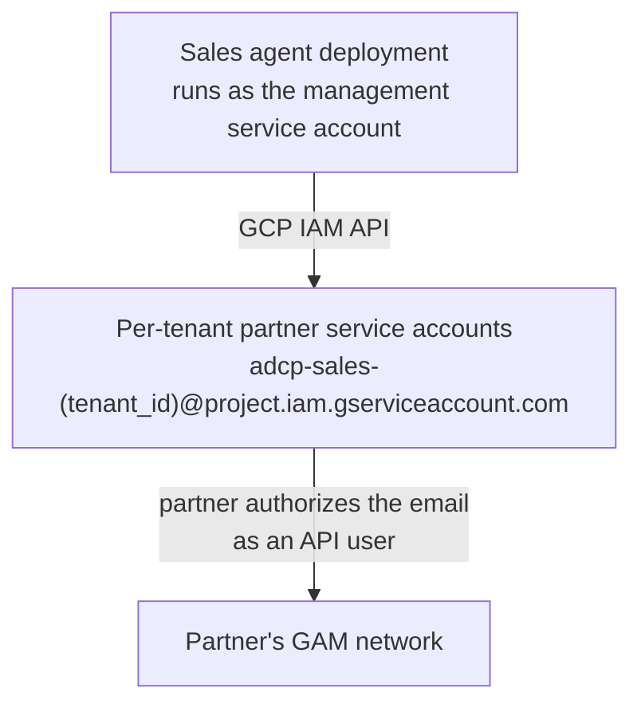

# GCP service account provisioning

How to set up the automatic service account provisioning feature for a production deployment. This is the one-time operator setup behind the **Create Service Account** button described in [GAM service account authentication](service-account-setup.md).

## Architecture

The deployment runs as a "management" service account, which creates one "partner" service account per tenant. Partners authorize those emails in their own GAM networks — no credentials cross the boundary.



## Prerequisites

1. A Google Cloud Platform (GCP) project.
2. Access to create service accounts in that project.
3. A deployment platform where you can set environment variables and secrets. The examples use the Fly.io CLI; any platform works.

> The `gcloud` and Fly.io commands here drive external consoles and tools whose
> interfaces change over time. Each step states what it achieves; adapt the
> exact commands to your tooling.

## Step-by-step setup

### Step 1: Create a GCP project (if needed)

```bash
# Create a GCP project (or use an existing one)
gcloud projects create adcp-sales-agent-prod --name="Prebid Sales Agent Production"

# Set it as the default project
gcloud config set project adcp-sales-agent-prod
```

### Step 2: Create the management service account

The application runs as this service account to create the per-tenant service accounts:

```bash
# Create the management service account
gcloud iam service-accounts create adcp-manager \
    --display-name="AdCP Service Account Manager" \
    --description="Service account used by Prebid Sales Agent to create partner service accounts"

# Capture the email
export SA_EMAIL="adcp-manager@adcp-sales-agent-prod.iam.gserviceaccount.com"
echo "Management Service Account: $SA_EMAIL"
```

### Step 3: Grant IAM permissions

The management service account needs permission to create other service accounts and their keys:

```bash
# Grant the Service Account Admin role (to create service accounts)
gcloud projects add-iam-policy-binding adcp-sales-agent-prod \
    --member="serviceAccount:$SA_EMAIL" \
    --role="roles/iam.serviceAccountAdmin"

# Grant the Service Account Key Admin role (to create service account keys)
gcloud projects add-iam-policy-binding adcp-sales-agent-prod \
    --member="serviceAccount:$SA_EMAIL" \
    --role="roles/iam.serviceAccountKeyAdmin"
```

The two roles map directly to what the feature does: `roles/iam.serviceAccountAdmin` lets it create and manage service accounts, and `roles/iam.serviceAccountKeyAdmin` lets it create their keys.

### Step 4: Generate the management service account key

```bash
# Create a JSON key for the management service account
gcloud iam service-accounts keys create ~/adcp-manager-key.json \
    --iam-account=$SA_EMAIL
```

Keep this key secure — it carries permission to create service accounts in your project.

### Step 5: Configure the deployment

The application reads two settings:

- `GCP_PROJECT_ID` (environment variable): The project in which partner service accounts are created.
- `GOOGLE_APPLICATION_CREDENTIALS_JSON` (secret): The management key's JSON contents. Alternatively, set `GOOGLE_APPLICATION_CREDENTIALS` to a file path, or rely on Application Default Credentials when running on GCP.

On Fly.io, for example:

```bash
# Set the project ID in your app's environment (the [env] section of fly.toml)
#   GCP_PROJECT_ID = "adcp-sales-agent-prod"

# Set the key as a secret
fly secrets set GOOGLE_APPLICATION_CREDENTIALS_JSON="$(cat ~/adcp-manager-key.json)" \
    --app adcp-sales-agent

# Verify it was set (the name is listed, not the value)
fly secrets list --app adcp-sales-agent
```

### Step 6: Deploy and verify

Deploy the application, then check its logs for the credentials being loaded:

```text
GCP credentials loaded from GOOGLE_APPLICATION_CREDENTIALS_JSON
```

### Step 7: Test the feature

1. Log in to the Admin UI.
2. Navigate to **Tenant Settings** → **Ad Server**.
3. Select **Google Ad Manager**.
4. In the **Service Account Integration** section, click **Create Service Account**.
5. A service account email appears — the feature works.

## Verification checklist

- [ ] GCP project created or identified
- [ ] Management service account created
- [ ] IAM roles granted (`serviceAccountAdmin` and `serviceAccountKeyAdmin`)
- [ ] Service account key generated
- [ ] `GCP_PROJECT_ID` set in the deployment environment
- [ ] `GOOGLE_APPLICATION_CREDENTIALS_JSON` set as a secret
- [ ] Application deployed
- [ ] Logs show credentials loaded
- [ ] Test service account creation works

## Troubleshooting

### Error: "GCP_PROJECT_ID not configured"

**Cause:** The environment variable is not set in the deployment.

**Fix:** Set `GCP_PROJECT_ID` to your project ID in the deployment environment and redeploy.

### Error: "Permission denied" or "IAM API not enabled"

**Cause:** Missing IAM permissions, or the IAM API is not enabled.

**Fix:**

```bash
# Enable the IAM API
gcloud services enable iam.googleapis.com --project=adcp-sales-agent-prod

# Re-grant permissions
gcloud projects add-iam-policy-binding adcp-sales-agent-prod \
    --member="serviceAccount:adcp-manager@adcp-sales-agent-prod.iam.gserviceaccount.com" \
    --role="roles/iam.serviceAccountAdmin"
```

### Warning: "No explicit GCP credentials provided"

**Cause:** Neither `GOOGLE_APPLICATION_CREDENTIALS_JSON` nor `GOOGLE_APPLICATION_CREDENTIALS` is set, so the application falls back to Application Default Credentials. Outside GCP, that fallback usually has no credentials.

**Fix:** Set the `GOOGLE_APPLICATION_CREDENTIALS_JSON` secret to the management key's JSON contents.

## Security best practices

1. **Rotate keys regularly**: Create a key every 90 days, update the secret, then delete the old key:

   ```bash
   # Create a key
   gcloud iam service-accounts keys create ~/new-key.json --iam-account=$SA_EMAIL

   # Update the deployment secret with the new key's contents, then delete the old key
   gcloud iam service-accounts keys delete KEY_ID --iam-account=$SA_EMAIL
   ```

2. **Least privilege**: Grant only the two roles listed in Step 3.

3. **Monitor usage**: Check GCP IAM audit logs for service account creation activity.

4. **Separate projects**: Consider a dedicated GCP project for service account creation.

## Cost considerations

Service account creation, service account keys, and IAM API calls (within quota) are free. The feature has no ongoing costs.

## Alternative: Application Default Credentials on GCP

If the application runs on GCP infrastructure, it can pick up credentials from the environment (Application Default Credentials, including Workload Identity) without a management key: leave `GOOGLE_APPLICATION_CREDENTIALS_JSON` unset and ensure the workload's identity carries the two IAM roles from Step 3. This avoids long-lived keys entirely but only works on GCP environments.

## How the flow works once configured

1. The application runs as the management service account (credentials from the secret).
2. A tenant admin clicks **Create Service Account** in the Admin UI.
3. The application creates a service account named `adcp-sales-<tenant_id>` in your project.
4. The partner authorizes that email in their GAM network.

No credential sharing between you and the partner is needed. The partner-side steps are described in [GAM service account authentication](service-account-setup.md).
