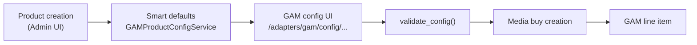
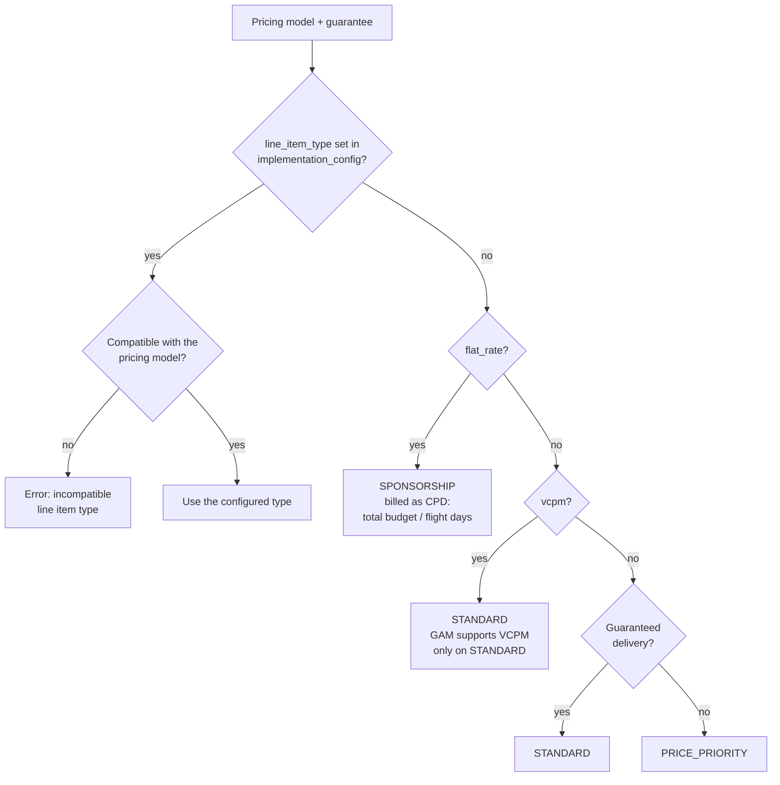

# GAM product configuration

How to configure Google Ad Manager (GAM) trafficking settings for products in the Prebid Sales Agent. The configuration system separates user-facing AdCP product fields from the internal GAM fields that line item creation requires.

## Contents

- [Overview](#overview)
- [Quick start](#quick-start)
- [Configuration workflow](#configuration-workflow)
- [Line item type selection](#line-item-type-selection)
- [Field reference](#field-reference)
- [Testing](#testing)
- [Troubleshooting](#troubleshooting)
- [API reference](#api-reference)
- [Best practices](#best-practices)
- [Related documentation](#related-documentation)

## Overview

The configuration model distinguishes three layers:

- **AdCP fields**: Price, formats, countries — visible to buyers.
- **GAM fields**: Priority, inventory targeting, creative placeholders — internal only.
- **`implementation_config`**: The JSONB column on the products table that stores all GAM-specific settings.

The following diagram shows how a product's GAM configuration flows from creation to a live line item:



For where adapters sit in the overall system, see [Architecture](../../development/architecture.md). For the adapter interface itself, see [Creating an adapter](../creating-an-adapter.md).

## Quick start

1. Create the product in the Admin UI (name, price, delivery type, formats). The system generates a default GAM configuration from the delivery type and formats.
2. On the product edit page, click **Configure GAM Adapter** to open the GAM configuration UI.
3. Use the inventory picker to select ad units or placements.
4. Adjust priority and other settings if needed.
5. Save the configuration.
6. Create a media buy. The adapter creates the GAM line items from the stored configuration. If a product still has no configuration at media buy time, the system generates defaults then.

## Configuration workflow

### Smart default generation

`GAMProductConfigService.generate_default_config()` derives defaults from the product's delivery type. Creative placeholders are derived from the product's formats.

Guaranteed products:

```json
{
  "cost_type": "CPM",
  "line_item_type": "STANDARD",
  "priority": 6,
  "primary_goal_type": "DAILY",
  "primary_goal_unit_type": "IMPRESSIONS",
  "delivery_rate_type": "EVENLY",
  "creative_rotation_type": "EVEN",
  "non_guaranteed_automation": "manual",
  "include_descendants": true,
  "creative_placeholders": ["..."]
}
```

Non-guaranteed products:

```json
{
  "cost_type": "CPM",
  "line_item_type": "PRICE_PRIORITY",
  "priority": 10,
  "primary_goal_type": "NONE",
  "primary_goal_unit_type": "IMPRESSIONS",
  "delivery_rate_type": "AS_FAST_AS_POSSIBLE",
  "creative_rotation_type": "OPTIMIZED",
  "non_guaranteed_automation": "confirmation_required",
  "include_descendants": true,
  "creative_placeholders": ["..."]
}
```

### GAM configuration UI

Open the product edit page in the Admin UI and click **Configure GAM Adapter**. The UI is served at `/adapters/gam/config/<tenant_id>/<product_id>`.

The UI provides the following features:

- Searchable inventory picker for ad units and placements
- Priority selection (1-16)
- Frequency cap configuration
- Creative placeholder management
- Custom targeting options

### Validation

`GAMProductConfigService.validate_config()` checks the configuration when you save it and again when a media buy is created:

- `priority` and `creative_placeholders` are present.
- `priority` is an integer between 1 and 16.
- Every creative placeholder has a `width` and a `height`.
- `line_item_type`, if present, is one of the valid values.

If no inventory targeting is set, validation passes but the adapter logs a warning and falls back to the network root ad unit.

At media buy creation, a missing or invalid configuration fails with an explicit error message.

## Line item type selection

You can set `line_item_type` explicitly, but you don't have to: when it is absent, `PricingCompatibility.select_line_item_type()` (in `src/adapters/gam/pricing_compatibility.py`) picks the type from the pricing model and the delivery guarantee. An explicit type that is incompatible with the pricing model is rejected with a `ValueError`.

The following decision tree shows how the adapter selects the line item type:



CPD (cost per day) is a GAM cost type, not an AdCP pricing model — the adapter uses it internally to translate flat-rate pricing into GAM's native flat-fee model.

## Field reference

The authoritative field list is the `GAMImplementationConfig` schema in `src/adapters/gam_implementation_config_schema.py`. The fields you set most often are described here.

### Validated fields

#### Priority

- **Field**: `priority` (required)
- **Type**: Integer, 1-16, where 1 is the highest priority
- **Defaults**: 6 for guaranteed, 10 for non-guaranteed
- **Guidelines**:
  - 1-4: Reserved for emergency or critical campaigns
  - 4-6: Guaranteed inventory
  - 8-12: Non-guaranteed and price priority
  - 16: House ads

#### Creative placeholders

- **Field**: `creative_placeholders` (required)
- **Type**: Array of objects
- **Structure**:

  ```json
  [
    {
      "width": 300,
      "height": 250,
      "expected_creative_count": 1,
      "is_native": false
    }
  ]
  ```

- **Auto-generated**: Derived from the product's formats

#### Line item type

- **Field**: `line_item_type` (optional)
- **Type**: String enum
- **Values**: `STANDARD`, `PRICE_PRIORITY`, `SPONSORSHIP`, `NETWORK`, `BULK`, `HOUSE`
- **Behavior**: When absent, the adapter selects the type from the pricing model — see [Line item type selection](#line-item-type-selection)

### Optional fields

#### Primary goal

- **Fields**: `primary_goal_type` (`DAILY`, `LIFETIME`, `NONE`) and `primary_goal_unit_type` (`IMPRESSIONS`, `CLICKS`, `VIEWABLE_IMPRESSIONS`)
- **Defaults**: `DAILY` for guaranteed, `NONE` for non-guaranteed; unit defaults to `IMPRESSIONS`

#### Inventory targeting

- **Fields**: `targeted_ad_unit_ids`, `excluded_ad_unit_ids`, `targeted_placement_ids` (arrays of strings), `include_descendants` (boolean, default `true`)
- **Behavior**: If no targeting is specified, the adapter uses the network root ad unit
- **Best practice**: Always specify targeting for production campaigns. GAM requires numeric IDs.

#### Frequency caps

- **Field**: `frequency_caps`
- **Type**: Array of objects
- **Structure**:

  ```json
  [
    {
      "max_impressions": 3,
      "time_unit": "DAY",
      "time_range": 1
    }
  ]
  ```

- **Time units**: `MINUTE`, `HOUR`, `DAY`, `WEEK`, `MONTH`, `LIFETIME`

#### Creative rotation

- **Field**: `creative_rotation_type`
- **Values**: `EVEN`, `OPTIMIZED`, `MANUAL`, `SEQUENTIAL`
- **Defaults**: `EVEN` for guaranteed, `OPTIMIZED` for non-guaranteed

#### Delivery rate

- **Field**: `delivery_rate_type`
- **Values**: `EVENLY`, `FRONTLOADED`, `AS_FAST_AS_POSSIBLE`
- **Defaults**: `EVENLY` for guaranteed, `AS_FAST_AS_POSSIBLE` for non-guaranteed

#### Custom targeting

- **Field**: `custom_targeting_keys`
- **Type**: JSON object
- **Example**:

  ```json
  {
    "sport": ["football", "basketball"],
    "geo": ["us-ny", "us-ca"]
  }
  ```

#### Non-guaranteed automation

- **Field**: `non_guaranteed_automation`
- **Values**: `automatic` (instant activation), `confirmation_required` (human approval, then automatic activation), `manual` (a human handles all steps)
- **Defaults**: `manual` for guaranteed, `confirmation_required` for non-guaranteed

## Testing

### Test the configuration UI

```bash
# Start Docker services
docker compose up -d

# Open the Admin UI
open http://localhost:8000
```

In the Admin UI, open a product, click **Configure GAM Adapter**, and exercise the inventory picker, priority setting, and save-time validation.

### Verify the stored configuration

Through the database:

```sql
SELECT
  product_id,
  name,
  delivery_type,
  implementation_config->>'line_item_type' as line_item_type,
  implementation_config->>'priority' as priority
FROM products
WHERE implementation_config IS NOT NULL;
```

Through the Admin UI:

1. Open a product and click **Configure GAM Adapter**.
2. Verify that the fields are populated.
3. Make a change and save it.
4. Reload the page and confirm that the change persists.

### Test media buy creation

- With a valid configuration: create a media buy for the product. It succeeds and creates a GAM line item.
- With an invalid configuration: remove a required field from `implementation_config` and attempt to create a media buy. It fails with an explicit validation error.

For the automated end-to-end stack, see [E2E testing](../../development/e2e-testing.md). For real-GAM manual tests, see [Testing setup](testing-setup.md).

## Troubleshooting

### "GAM configuration validation failed"

- **Cause**: Required fields are missing from `implementation_config`.
- **Fix**: Click **Configure GAM Adapter** on the product and complete the required fields.

### Inventory picker not loading

- **Cause**: No inventory has been synced for the tenant.
- **Fix**: Run an inventory sync from the Admin UI's inventory browser (**Sync All**).

## API reference

### GAM configuration service

```python
from src.services.gam_product_config_service import GAMProductConfigService

service = GAMProductConfigService()

# Generate defaults
config = service.generate_default_config(
    delivery_type="guaranteed",
    formats=["display_300x250"],
)

# Validate a config
is_valid, error_msg = service.validate_config(config)

# Parse GAM config form data
impl_config = service.parse_form_config(request.form)
```

### Inventory list endpoint

```http
GET /api/tenant/{tenant_id}/inventory-list
  ?type=ad_unit
  &search=sports
  &status=ACTIVE
```

Query parameters:

- `type`: `ad_unit` or `placement`; omit for both.
- `search`: Case-insensitive partial match on the name.
- `status`: Defaults to `ACTIVE`; use `ALL` for all statuses.
- `ids`: Comma-separated inventory IDs to fetch directly, bypassing the result limit.

Response:

```json
{
  "items": [
    {
      "id": "123456",
      "name": "Sports Homepage",
      "path": ["Sports", "Homepage"],
      "type": "ad_unit",
      "status": "ACTIVE"
    }
  ],
  "count": 1,
  "has_more": false
}
```

## Best practices

### Priority

- **Emergency or critical**: 1-4 (use sparingly)
- **Guaranteed**: 4-6
- **Non-guaranteed**: 8-12
- **House ads**: 16

### Inventory targeting

- Always specify ad units or placements rather than relying on the network-root fallback.
- Use placements for grouped inventory.
- Use ad units with `include_descendants` for hierarchies.
- Test targeting in GAM before production.

### Creative placeholders

- Match the product's formats exactly.
- Set `expected_creative_count` to the number of creatives you expect per size.
- Set `is_native: true` for native formats.

### Frequency caps

- Set reasonable caps (3-5 per day is typical).
- Use `LIFETIME` caps for awareness campaigns.
- Test the impact on delivery before production, and monitor fill rate after enabling caps.

## Related documentation

- [GAM adapter overview](README.md) — supported features and pricing model mapping
- [Testing setup](testing-setup.md) — real-GAM manual test configuration
- [Creating an adapter](../creating-an-adapter.md) — the adapter interface this configuration feeds
- [Architecture](../../development/architecture.md) — where adapters sit in the system
- [E2E testing](../../development/e2e-testing.md) — the automated test stack
