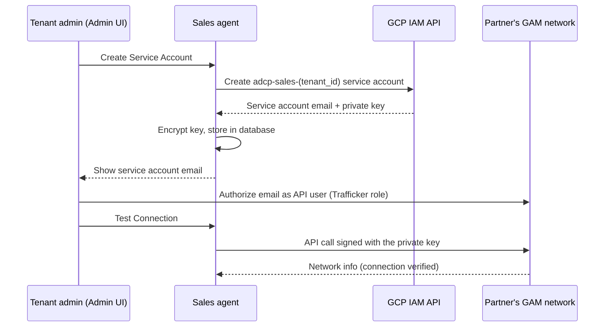

# GAM service account authentication

The Prebid Sales Agent supports two authentication methods for Google Ad Manager (GAM): OAuth refresh tokens and service accounts. This guide explains both, with service accounts — the method recommended for production — covered in depth.

## Contents

- [Authentication methods](#authentication-methods)
- [Automatic service account provisioning](#automatic-service-account-provisioning)
- [Security model](#security-model)
- [Required service account roles](#required-service-account-roles)
- [Prerequisites for automatic provisioning](#prerequisites-for-automatic-provisioning)
- [Set up automatic provisioning](#set-up-automatic-provisioning)
- [Alternative: bring your own service account](#alternative-bring-your-own-service-account)
- [Security considerations](#security-considerations)
- [Troubleshooting](#troubleshooting)
- [Migrate a tenant from OAuth to a service account](#migrate-a-tenant-from-oauth-to-a-service-account)
- [Comparison: OAuth vs service account](#comparison-oauth-vs-service-account)
- [API reference](#api-reference)
- [FAQ](#faq)
- [Related documentation](#related-documentation)

## Authentication methods

1. **OAuth (refresh token)** — user-based authentication that requires manual token refresh.
2. **Service account** — automated authentication using Google Cloud service accounts. Recommended for production.

Service accounts offer the following advantages:

- **No manual refresh**: Service account credentials don't expire the way OAuth tokens do.
- **Better for automation**: No user interaction is needed.
- **Granular permissions**: The partner can scope access to specific advertisers.
- **Audit trail**: The service account appears in GAM audit logs.
- **Multi-tenant**: Each tenant can have its own service account.
- **No file management**: Credentials are stored encrypted in the database.

## Automatic service account provisioning

For partner integrations, the sales agent can create and manage service accounts itself, so partners never send their service account JSON credentials. The flow:

1. The sales agent creates a service account in the operator's GCP project.
2. The Admin UI shows the partner the service account email.
3. The partner authorizes that email as an API user in their GAM network.
4. The sales agent manages the credentials — encrypted, in its database.

The following diagram shows who obtains what from whom, and in which order:



See [GCP provisioning](gcp-provisioning.md) for the one-time deployment setup that enables this feature.

## Security model

Service account authentication uses two-factor control:

1. **Private key** (the sales agent controls it): Stored encrypted in the sales agent's database and used to cryptographically sign API requests.
2. **GAM user list** (the partner controls it): The partner must explicitly add the service account email to their GAM network.

Both are required for access:

- Knowing the email is not enough — API calls must be signed with the private key.
- Holding the private key is not enough — the partner must grant permissions in their GAM.

The partner keeps control:

- They can revoke access at any time by removing the email from GAM.
- They choose which role to grant (Trafficker, Salesperson, or a custom role).
- They can restrict access to specific advertisers through GAM teams.
- All activity appears in their GAM audit logs.

## Required service account roles

> These roles and permissions are defined in the GAM console, which Google changes over time. Treat the lists here as the goal to achieve, not as exact console wording.

### Recommended: Trafficker role

The Trafficker role fits most deployments. It provides:

- Create and manage orders (campaigns)
- Create and manage line items
- Upload and associate creatives
- Read inventory (ad units, placements)
- Read and write custom targeting
- Generate reports

It cannot modify network settings or create advertisers.

### Alternative: Salesperson role

For read-mostly access with limited write ability:

- Create proposals (if using Programmatic Guaranteed)
- View orders and line items

It cannot create orders directly, and creative management is limited.

### Custom role (minimum permissions)

If you create a custom role, grant the service account these permissions:

```text
Orders:            Create, Read, Update
Line items:        Create, Read, Update
Creatives:         Create, Read, Update, Associate
Ad units:          Read (for inventory sync)
Placements:        Read
Custom targeting:  Read, Write
Reports:           Run
Network:           Read (for timezone and network info)
```

## Prerequisites for automatic provisioning

Automatic service account creation requires:

1. **GCP project configuration**: Set the `GCP_PROJECT_ID` environment variable to your Google Cloud project ID.
2. **IAM permissions**: The application's credentials must be able to create service accounts and keys in that project (`roles/iam.serviceAccountAdmin` and `roles/iam.serviceAccountKeyAdmin`).

[GCP provisioning](gcp-provisioning.md) walks through this setup.

## Set up automatic provisioning

### Step 1: Request service account creation

1. Log in to the Admin UI (`http://localhost:8000` or your production URL).
2. Navigate to **Tenant Settings** → **Ad Server**.
3. Select **Google Ad Manager** as the adapter.
4. In the **Service Account Integration** section, click **Create Service Account**.
5. Wait a few seconds while the sales agent creates the service account in its GCP project.
6. Copy the service account email that appears.

### Step 2: Authorize the service account in your GAM

> **Important:** Do not add the service account through the regular
> **Access & authorization → Users** flow. That flow sends an email invitation,
> which a service account has no inbox to accept. Use the API-access flow
> under Global Settings instead. The GAM console's wording changes over time;
> the goal of each step is what matters.

1. Log in to your [Google Ad Manager](https://admanager.google.com/) account.
2. Navigate to **Admin** → **Global Settings**.
3. In the **API access** section, ensure API access is turned on.
4. Add the service account as an API user (**Add a service account user**), pasting the email from Step 1.
5. Assign the **Trafficker** role (recommended).
6. Optionally restrict the account to specific advertisers through **Teams** (recommended for security).
7. Save.

### Step 3: Test the connection

1. Return to the Admin UI settings page.
2. Click **Test Connection**.
3. If the test fails, verify the following points:
   - API access is turned on under GAM **Admin** → **Global Settings**.
   - The service account was added through the API-access flow, not the Users page.
   - The service account email appears under GAM **Admin** → **Access & authorization** → **Users** as an active user — this is how you confirm that the authorization took effect.
   - The Trafficker role is assigned.
   - You saved the changes in GAM.

## Alternative: bring your own service account

Use this flow only if you need to create and control the service account yourself; automatic provisioning is recommended otherwise.

### Step 1: Create a service account in the Google Cloud console

1. Go to the [Google Cloud console](https://console.cloud.google.com/).
2. Select your project, or create one.
3. Navigate to **IAM & Admin** → **Service Accounts**.
4. Create a service account with a descriptive name, such as `adcp-sales-agent`.
5. Skip GCP role assignment — permissions are granted in GAM directly.

### Step 2: Create and download a service account key

1. Open the service account you created.
2. On the **Keys** tab, add a key and choose the **JSON** format.
3. The JSON key file downloads automatically.
4. Store the file securely — it cannot be recovered if lost.

### Step 3: Grant access in Google Ad Manager

Authorize the service account email (format: `adcp-sales-agent@PROJECT-ID.iam.gserviceaccount.com`) in your GAM network as described in [Step 2 of the automatic flow](#step-2-authorize-the-service-account-in-your-gam): API-access flow, Trafficker role, optionally restricted to specific advertisers through Teams.

### Step 4: Configure the Prebid Sales Agent

Through the Admin UI:

1. Log in to the Admin UI.
2. Navigate to **Tenant Settings** → **Ad Server**.
3. Select **Service Account** as the authentication method.
4. Paste the contents of the JSON key file from Step 2.
5. Enter the network code if it is not auto-detected.
6. Click **Test Connection** to verify, then save.

Through the API:

```bash
curl -X POST http://localhost:8000/tenant/{tenant_id}/gam/configure \
  -H "Content-Type: application/json" \
  -d '{
    "auth_method": "service_account",
    "service_account_json": "{...JSON key contents...}",
    "network_code": "12345678"
  }'
```

## Security considerations

### Credential storage

- The service account JSON is encrypted at rest with Fernet symmetric encryption.
- The encryption key comes from the `ENCRYPTION_KEY` environment variable. Generate one with `uv run python scripts/generate_encryption_key.py` (or `python -c 'from cryptography.fernet import Fernet; print(Fernet.generate_key().decode())'`).
- Credentials are decrypted only when an API call needs them.

### Access control

- Grant the service account the minimum required permissions.
- Use team-based access in GAM to restrict it to specific advertisers.
- Give each tenant a separate service account for isolation.
- The service account email appears in GAM audit logs for accountability.

### Best practices

1. **Rotate keys regularly**: Create a key and delete the old one every 90 days.
2. **Use separate service accounts per tenant**: Better isolation and security.
3. **Monitor audit logs**: Check GAM audit logs for unexpected service account activity.
4. **Restrict advertiser access**: Don't grant network-wide access if it isn't needed.
5. **Secure the encryption key**: Store `ENCRYPTION_KEY` in a secrets manager, not in code.

## Troubleshooting

### "Invalid service account JSON" error

**Cause**: The JSON is malformed or incomplete.

**Solution**: Ensure the JSON contains all required fields:

- `type: "service_account"`
- `project_id`
- `private_key_id`
- `private_key`
- `client_email`

### "Permission denied" errors

**Cause**: The service account lacks the required permissions in GAM.

**Solution**:

1. Confirm the service account was authorized through the API-access flow under **Admin** → **Global Settings**, not through the Users page — the Users page sends an email invitation, which does not work for service accounts.
2. Open **Admin** → **Access & authorization** → **Users** and confirm the service account email appears as an active user. This verifies that the authorization took effect.
3. Check that the Trafficker role, or an equivalent, is assigned.
4. Ensure the service account has access to the specific advertiser.

### "Network code not found" error

**Cause**: The service account has no access to the specified network.

**Solution**:

1. Verify the network code.
2. Check that the service account is added to the correct GAM network.
3. If you manage multiple networks, ensure the correct one is selected.

### Connection test fails

**Cause**: Authentication or network issues.

**Solution**:

1. Check that the service account JSON is complete and valid.
2. Verify connectivity to Google APIs — outbound HTTPS on port 443 must be allowed.
3. Verify that the service account hasn't been deleted or turned off.

GAM API calls go out through the `googleads` SDK, a fixed-destination vendor SDK that is an authorized direct caller under this codebase's egress policy — see [Outbound egress](../../security/outbound-egress.md).

## Migrate a tenant from OAuth to a service account

1. Create and authorize the service account (either flow described earlier).
2. In the Admin UI, go to **Tenant Settings** → **Ad Server**.
3. Change the authentication method to **Service Account**.
4. Provide the service account JSON key (bring-your-own flow only).
5. Test the connection, then save.

On save, the system clears the old OAuth refresh token, encrypts and stores the service account JSON, and updates the authentication method in the database. Campaigns, creatives, and other data are unaffected.

## Comparison: OAuth vs service account

| Feature | OAuth (refresh token) | Service account |
|---------|----------------------|-----------------|
| Setup complexity | Medium (manual OAuth flow) | Low (JSON key, or automatic provisioning) |
| Token expiration | Yes (requires refresh) | No |
| User dependency | Requires a Google account | Independent |
| Automation | Difficult | Straightforward |
| Audit trail | User email | Service account email |
| Credential storage | Token string | JSON key (encrypted) |
| Best for | Development, testing | Production, automation |

## API reference

### AdapterConfig model fields

```python
gam_auth_method: str                    # "oauth" or "service_account" (default "oauth")
gam_refresh_token: str | None           # OAuth refresh token (OAuth method)
gam_service_account_json: str | None    # Service account JSON (service account method);
                                        # stored encrypted, decrypted on property access
```

### GAMAuthManager methods

```python
# Check the authentication method
auth_manager.is_oauth_configured() -> bool
auth_manager.is_service_account_configured() -> bool
auth_manager.get_auth_method() -> str  # "oauth", "service_account", or "none"

# Get credentials (handles both methods)
auth_manager.get_credentials() -> Credentials
```

### Helper functions

```python
from src.adapters.gam import build_gam_config_from_adapter

# Build a config dict from an AdapterConfig model
config = build_gam_config_from_adapter(adapter_config)
# Returns a dict with the appropriate auth credentials for the configured method
```

## FAQ

**Can I use the same service account for multiple tenants?**

Yes, but it is not recommended. Give each tenant its own service account for isolation and security.

**What happens if the service account key leaks?**

Delete the compromised key immediately in the Google Cloud console, create a key, and update the configuration in the Prebid Sales Agent.

**Can I switch between OAuth and a service account without losing data?**

Yes. The authentication method only affects how the sales agent connects to GAM. Campaigns, creatives, and other data remain unchanged.

**Do I need to rotate service account keys?**

Yes. Google recommends rotating keys every 90 days: create a key, update the configuration, then delete the old key.

**Can I use a service account for development and testing?**

Yes, but OAuth is often more convenient for development because you can use your own Google account. Service accounts are recommended for production.

## Related documentation

- [GAM adapter overview](README.md) — supported features
- [GCP provisioning](gcp-provisioning.md) — deployment setup for automatic provisioning
- [Testing setup](testing-setup.md) — GAM test environment configuration
- [Outbound egress](../../security/outbound-egress.md) — where GAM API traffic fits in the egress policy
