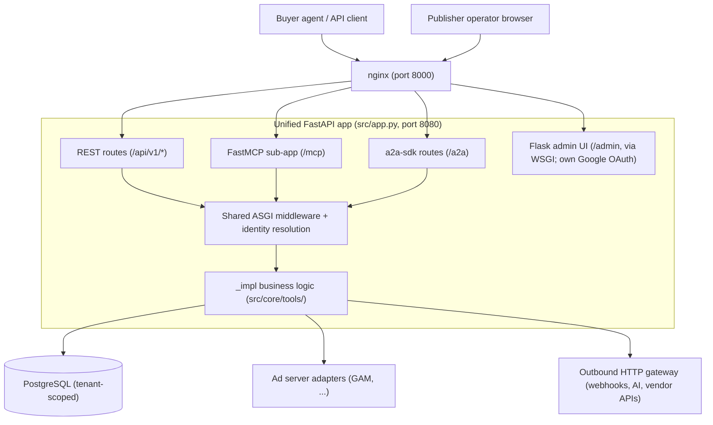
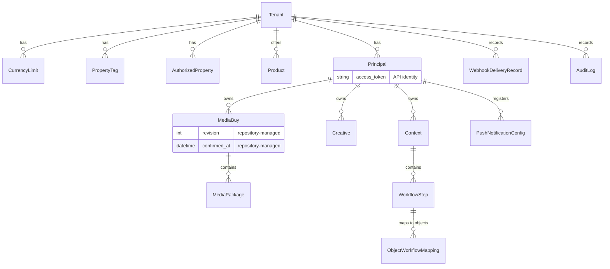
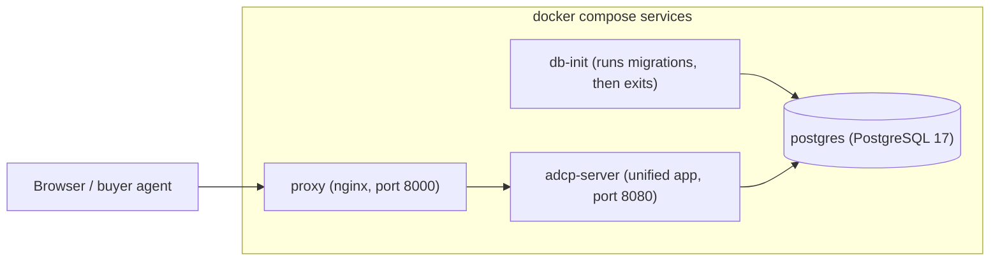

# Architecture guide

This guide is the top-level map of the Prebid Sales Agent: what the system
is, what its parts are, and where to read more. Each section stays at
overview level and links to the document that covers the details.

## System overview

The Prebid Sales Agent is a multi-tenant sales agent that implements the
[Ad Context Protocol](../adcp-spec-version.md) (AdCP): buyers' AI agents
discover products, create media buys, and submit creatives over MCP, A2A, or
REST; the agent executes those buys on the publisher's ad server through a
per-tenant adapter. Publishers operate it through a web admin UI.

## System topology

One process runs behind nginx. A single FastAPI application (`src/app.py`)
serves every protocol; there is no per-protocol server. The following diagram
shows how a request reaches business logic and what the process depends on:

### Component map

The following table maps each component to its location in the source tree:

| Component | Location | Description |
|-----------|----------|-------------|
| App assembly | `src/app.py` | Builds the FastAPI app, mounts every entry point, registers middleware |
| MCP server | `src/core/main.py` | FastMCP tool registration; mounted at `/mcp` |
| A2A server | `src/a2a_server/` | Agent-to-agent JSON-RPC handlers; routes added at `/a2a` |
| REST API | `src/routes/` | `/api/v1/*` FastAPI routes, health endpoints |
| Admin UI | `src/admin/` | Flask app (Google OAuth), mounted into FastAPI via WSGI |
| Business logic | `src/core/tools/` | Transport-agnostic `_impl` functions — the only place behavior lives |
| Schemas | `src/core/schemas/` | Pydantic models extending the `adcp` library types |
| Data access | `src/core/database/` | ORM models, repositories, unit of work, migrations |
| Adapters | `src/adapters/` | Ad-server integrations behind one abstract interface |
| Services | `src/services/` | Cross-cutting domain services: targeting, policy, webhooks, AI |
| Egress gateway | `src/core/security/outbound_http.py` | The single gateway for all outbound HTTP |

## Request path

Every request enters through one of the four entry points, passes the shared
ASGI middleware stack, and has its token resolved to a `ResolvedIdentity`
(tenant + principal) before any business logic runs. The full trace — the
middleware stack in execution order, `resolve_identity`, the per-transport
path, and a "where does my change go?" table — is in
[Request lifecycle](request-lifecycle.md).

## Layering and the transport-parity invariant

All business behavior is identical across MCP, A2A, and REST, because all
three transports call the same `_impl` functions; wrappers do only identity
resolution, error translation, and protocol framing. This is the central
invariant of the codebase: any logic that leaks into a wrapper exists on one
transport and silently not on the others.

The layering rules — what `_impl` may accept, raise, and return, and why —
are defined in [Architecture principles](architecture-principles.md).
[Structural guards](structural-guards.md) enforce them mechanically, so
violations fail `make quality` rather than waiting for review.

## Multi-tenancy

Isolation is database-backed and row-level. Most domain tables carry a
`tenant_id` foreign key; the rest — media packages, workflow steps and object
mappings — are scoped through the parent row that does. Every query is
tenant-scoped through the repository layer. A request's tenant is resolved from its token before
`_impl` runs, so business logic never sees data outside its tenant.

- **Tenant** — a publisher. Configuration lives in individual columns on the
  row (ad server, policy settings, authorized emails/domains, webhooks), not
  in a single JSON column.
- **Principal** — an advertiser within a tenant, identified by its API
  `access_token`; `platform_mappings` ties it to accounts on the ad server.
- Admin users, products, media buys, creatives, and audit logs all belong to
  the tenant.

## Data model

The following diagram shows the main entities and which entity owns which;
`src/core/database/models.py` holds the authoritative definitions:

Principal-owned rows also carry `tenant_id` directly; rows without their own
`tenant_id` (media packages, workflow steps, object mappings) are
tenant-scoped through their parent. `Context`, `WorkflowStep`, and
`ObjectWorkflowMapping` implement human-in-the-loop workflows;
`PushNotificationConfig` and `WebhookDeliveryRecord` implement outbound
notification. Secondary tables hang off these entities — products have
pricing options and inventory mappings, creatives have reviews and
package assignments.

Setup order matters: a tenant needs its `CurrencyLimit` row (USD, required
before budgets validate) and its `PropertyTag` row (`all_inventory`, required
before products) before you can create products, and products before media
buys.

All access goes through repositories (`src/core/database/repositories/`);
some models additionally defend their own invariants — `MediaBuy` refuses
construction with repository-managed fields preset. The rules for what may
touch the database, and why reads are trusted rather than re-validated, are
in [Architecture principles](architecture-principles.md).

## Adapter pattern

An adapter translates AdCP operations into one ad server's API. All adapters
implement `AdServerAdapter` (`src/adapters/base.py`); the registry in
`src/adapters/__init__.py` selects one per tenant.

An adapter owns the following responsibilities:

- **Platform authentication** — its own credentials and session handling
- **API translation** — AdCP requests → platform orders/line items, platform
  state → AdCP status and delivery reporting
- **Creative handling** — uploading assets and associating them with line items
- **Dry-run simulation** — every operation can run without touching the platform

The registry contains the following adapters:

| Registry key | Adapter | Notes |
|--------------|---------|-------|
| `gam`, `google_ad_manager` | Google Ad Manager | Most complete; see the [adapter documentation](../adapters/README.md) |
| `broadstreet` | Broadstreet | |
| `kevel` | Kevel | |
| `triton`, `triton_digital` | Triton Digital | Audio |
| `mock` | Mock ad server | Testing and development |

(`creative_engine` in the registry is a creative-processing base class, not
an ad-server adapter.)

## Targeting

Targeting dimensions have a two-tier access model, defined in
`src/services/targeting_capabilities.py`. **Overlay** dimensions (geo,
device, content, audience segments, frequency caps) are buyer-settable
through the AdCP `targeting_overlay`. **Managed-only** dimensions (AEE
signals and scores) are set internally and never accepted from a buyer.
Adapters translate accepted dimensions into their platform's targeting
structures.

## AI integration

AI is provider-pluggable through Pydantic AI (`src/services/ai/`): the
platform default provider/model comes from environment variables, and each
tenant can override it in its own AI config. Agents built on this factory
handle policy checks, creative review, naming, and ranking
(`src/services/ai/agents/`). Generative creative processing requires the
configured provider's API key and fails explicitly when it is missing.

## Outbound HTTP

Every outbound request — webhooks, adapter vendor calls, AI providers —
leaves through one gateway, `src/core/security/outbound_http.py`. The
application deliberately implements no SSRF protection anywhere else; the
gateway and the `adcp` SDK own address validation, TLS, redirect, and retry
policy. See [Outbound egress](../security/outbound-egress.md) for the rule
and the [egress SDK boundary](../design/egress-sdk-boundary.md) for the
design.

## Security

- **Identity layers**: super-admin allowlist (`SUPER_ADMIN_EMAILS`) →
  Google OAuth for admin users → tenant-scoped roles → per-principal API
  tokens. Token-to-identity resolution is traced in
  [Request lifecycle](request-lifecycle.md).
- **Audit**: the audit logger (`src/core/audit_logger.py`) writes
  security-relevant operations to `audit_logs` with tenant and principal
  context.
- **Isolation**: tenant scoping at the repository layer, enforced by
  structural guards.

See the [security guide](../security.md) for more.

## Deployment topology

Local development runs four compose services (`docker-compose.yml`):
`postgres` (17-alpine), `db-init` (runs migrations, then exits),
`adcp-server` (the unified app on 8080), and `proxy` (nginx on 8000).
The following diagram shows the services and their startup order —
`adcp-server` waits for a healthy database and completed migrations, and
`proxy` waits for `adcp-server`:

Production uses the same topology — nginx in front of the single app process
and a managed PostgreSQL — on any Docker-compatible platform. See
[single-tenant deployment](../deployment/single-tenant.md) and
[multi-tenant deployment](../deployment/multi-tenant.md).

## Testing

[End-to-end testing](e2e-testing.md) and
[tests/CLAUDE.md](../../tests/CLAUDE.md) cover the test stack, its suites,
and how to run them. The architectural point: because behavior lives in
`_impl` and the transports are thin, behavioral tests verify the same
scenarios across all transports, and structural guards enforce the layering
on every `make quality` run.

## Extension points

The following table shows where each kind of extension goes:

| To add | Do | Documented in |
|--------|----|---------------|
| An AdCP tool | Extend the library schema → `_impl()` in `src/core/tools/` → MCP wrapper → A2A raw function → tests | [Architecture principles](architecture-principles.md), root `CLAUDE.md` |
| An ad-server adapter | Implement `AdServerAdapter`, register it in `ADAPTER_REGISTRY` (`src/adapters/__init__.py`) | [Adapter documentation](../adapters/README.md) |
| An admin page / REST route | Flask blueprint in `src/admin/` or router in `src/routes/`; check for route conflicts | [Request lifecycle](request-lifecycle.md) |
| A table or column | ORM model + repository + Alembic migration (`uv run alembic revision`) | root `CLAUDE.md` |
| An outbound call | Call the egress gateway — never a raw HTTP client | [Outbound egress](../security/outbound-egress.md) |
