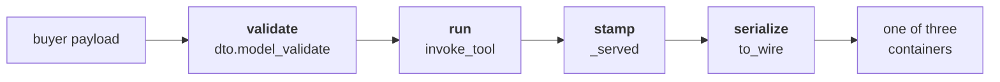
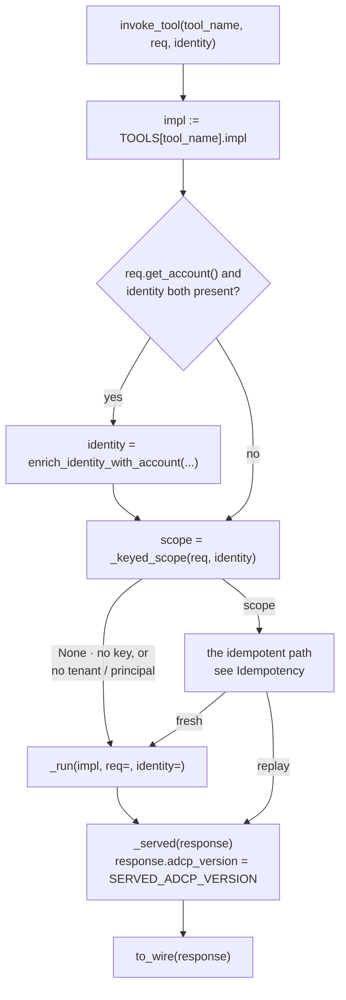
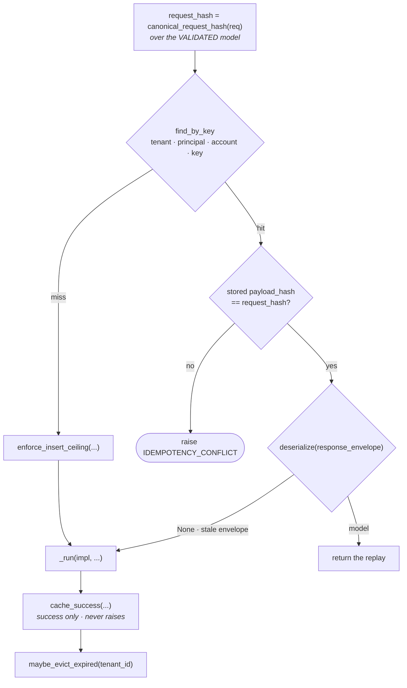

# How a tool works

The design this codebase implements. Read "One declaration" and "The request lifecycle" first. The lifecycle is the spine, and
every other rule here follows from it.

AdCP **3.1.1** via the `adcp` SDK. Companion pages: [architecture.md](architecture.md),
[patterns-reference.md](patterns-reference.md), [structural-guards.md](structural-guards.md).

---

## One declaration

A tool is declared once, in `src/core/tools/registry.py`:

```python
TOOLS: Mapping[str, ToolSpec] = {
    "get_products": ToolSpec(
        dto=GetProductsRequest,      # what it accepts
        impl=_get_products_impl,     # what runs
        rest=RestBinding("POST", "/products"),
        a2a=True,
        auth="optional",
    ),
    ...
}
```

`ToolSpec` says **where** a tool is reachable and **what** runs it. It says nothing about its
shape, because the DTO says that itself — which is why `dto` holds a model rather than a
description of one.

Everything else is derived, so nothing can disagree with it:

| derived | from |
|---|---|
| MCP tool + advertised JSON Schema | `spec.dto.model_json_schema()` |
| A2A skill, agent-card entry, dispatch | iteration over `TOOLS` |
| REST route + request body | `spec.rest` + `spec.dto` |
| auth requirement on all three | `spec.auth` |

`auth` is a property of the **tool**, not of a transport. That is what makes "MCP soft-returns
where A2A hard-refuses" unrepresentable instead of a bug to find.

### Registration refuses

`_register_tool` raises at import rather than registering something incoherent:

1. **No request DTO** — nothing to derive an advertised shape from.
2. **A DTO that does not inherit the SDK's request model**, for a tool the pin defines. The
   announced shape would become tautological: it would advertise whatever we happened to
   write. `sdk_grounding()` decides this by walking the live MRO and asking where a
   field-carrying ancestor is *defined*, so it depends on no import spelling.
3. **A response model that does not descend from `AdcpVersionEnvelope`** — it could not carry
   `adcp_version`, and since `exclude_none=True` drops unset fields, the omission would be
   silent on every transport.

Each refusal replaces a guard that would have reported the violation afterwards. Making the
making the state unreachable beats grading it. See "Guards are the last resort, not the first".

---

## The request lifecycle

**This is the design. Everything that follows is a consequence.**

**The shape, from far away.** Four stages, and only the third is the tool's own code:



Each transport owns only the first stage — turning its bytes into a DTO — and then names the
tool. Everything from `invoke_tool` onward is shared, which is why a behaviour cannot exist on
one transport and not another.

**Zooming into `invoke_tool`.** It resolves the implementation from the registry, resolves the
caller, and decides whether this call is idempotent:



`_run` calls the implementation and awaits it only if it returned an awaitable, so a plain
`def` and an `async def` are both registrable. `_served` wraps *both* answers — a fresh run and
a replay — so a replayed response echoes the release serving it.


Three properties define the system:

**One entry.** A transport's last act is to name a tool and hand over the request it validated;
everything after that is inside `invoke_tool` → `invoke`. Which function runs is the registry's
answer, not the caller's, so no transport can reach a different implementation — or a different
pre-implementation sequence — than the others.

Two paths in that diagram are worth naming, and both are load-bearing. **The unkeyed
short-circuit:** `_keyed_scope` returns `None` when the request carries no key *or* the
identity resolved no tenant or principal, and that path never hashes and never looks up a
replay. **The conflict exit:** a payload conflict is *raised*, so it leaves `_invoke` as an
exception and never passes through `_served` — an error is not a response and is never
stamped, never cached.

**One signature.** Every implementation is `(req, identity)` and nothing else. There is no
per-transport channel, so no transport can hand an implementation a value the others cannot.
A `**extra` kwarg filled by one transport is how a branch becomes reachable on one of three.

**One exit.** `to_wire()` is the only place a response model becomes a body, and it is
`model_dump(mode="json")` and nothing else. The three transports differ only in the
*container* — that is the only thing that legitimately differs between them.

### Consequences

- **MCP subclasses `Tool`, not `FunctionTool`.** FastMCP validates a function tool through a
  TypeAdapter built from its annotations, which reaches the SDK's nested models before any of
  our code runs — a second validation program with different answers. `RegistryTool.run`
  receives the raw argument dict and validates the way the other transports do. That
  divergence is why MCP once needed a compatibility layer of its own; the `mode="before"`
  validator on the model answers, for every transport, the question that layer existed to
  answer on one.
- **No implementation calls another implementation.** A controller may delegate to a
  *service*; it never re-enters the boundary. Beyond layering, this is what stops a nested
  call from being "a second request wearing the same idempotency key".
- **Nothing reaches an `_impl` except through `invoke()`.** A service that imports one
  directly bypasses the account scope, the replay, and the version stamp.
- **An implementation returns a model and never serializes.** No `.model_dump()` in an
  `_impl`; the body is produced once, at the boundary.
- **An implementation is typed to OUR model, never the SDK's.** The SDK's model is the spec's
  shape; ours is that shape plus internal fields the wire never sees. Ours subclasses theirs,
  so `isinstance(ours, LibraryRequest)` holds and the reverse does not — typing a parameter to
  the SDK model would accept an instance our code cannot rely on. Every `_impl` has the same
  signature: `req: <Tool>Request, identity: ResolvedIdentity`. The boundary calls all of them
  identically, so a drifting signature raises `TypeError` at the one call site instead of
  rebinding silently.
- **A return is a success.** There is no status-sniffing on the way out; an error is raised,
  not returned.

---

## Shapes: request, response, envelope

### The DTO is the SDK's model, extended

A request DTO subclasses the SDK's pinned request model and adds nothing the spec does not
declare. `build_request` is `TOOLS[tool].dto.model_validate(payload)` — one line, because the
DTO is already the accepted shape.

**We do not declare a narrowed subset of the SDK's fields.** The DTO carries the spec's whole
vocabulary; a field this codebase does not implement is unused. Inheritance is what makes the
model's provenance checkable — `sdk_grounding()` proves a DTO carries the spec's fields by
walking the live MRO, which is why the DTO must *extend* the SDK model rather than be
reconstructed from it.

> **Why narrowing is fragile**, recorded so it is not reattempted. Popping from `model_fields`
> plus `model_rebuild(force=True)` narrows the class itself but does not survive subclassing,
> and it fails destructively: a subclass re-collects from the annotation, so popped fields
> return — and return **required**, because the pop destroyed the `FieldInfo` carrying their
> defaults. Building the model with `create_model` from the SDK's own `FieldInfo` objects
> avoids the mutation and works, but breaks `sdk_grounding()`'s MRO walk, which is the check
> that makes provenance provable. Narrowing also buys nothing a buyer can observe: production
> runs `extra="ignore"`, so an unimplemented field is ignored whether popped or merely unused.

### Envelope fields vs request fields

**Envelope fields** are properties of the call and the seller. They are declared by the SDK's
`AdcpVersionEnvelope` / `ProtocolEnvelope` and inherited by every model. An implementation
neither knows them nor should have to.

| field | request | response |
|---|---|---|
| `adcp_version` | the release the buyer pins | the release we served — set by `_served()` |
| `adcp_major_version` | the major the buyer pins | — |
| `idempotency_key` | at-most-once key, read by the boundary | — |
| `replayed` | — | set by the boundary on a cache hit |
| `message` | — | a declared field the implementation fills |
| `context`, `ext` | echoed / free-form | echoed / free-form |

**Request fields** are the tool's own vocabulary — `brief`, `packages`, `media_buy_id`. They
are what the implementation reads.

You never add an envelope field to a model; extending the SDK's model gives you the whole
envelope with the SDK's types and constraints. `BuyerRequest` lets the boundary ask any
request for its account and key even when that request's schema declares neither — as
*methods*, because pydantic will not let a field shadow a property of the same name.

### allOf is inheritance; oneOf is one class per branch

```
REQUEST — every tool, no exceptions

    adcp.types.<Tool>Request              BuyerRequest
    (SDK · the spec's fields)             (ours · account + key accessors)
                        \                /
                         <Tool>Request
                         (ours · what the tool accepts)


RESPONSE — single-shape tools

    AdcpVersionEnvelope        ProtocolEnvelope        (SDK · the schema's allOf pair)
                        \     /
                      AdcpResponse                     (ours · declares no fields itself)
                            |
    adcp.types.<Tool>Response                          (SDK · the tool's own fields)
                        \     /
                     <Tool>Response                    (ours · what the impl returns)


RESPONSE — oneOf tools

                      AdcpResponse
                            |
                       <Tool>Result                    (ours · the union, named as a TYPE)
                    /       |       \
      <Tool>Success   <Tool>Error   <Tool>Submitted    (one class per branch, flattened)
      each branch: (adcp.types.<Tool>Success, <Tool>Result)
```

Those three shapes, spelled out in real declarations:

```python
# request — the SDK's model plus the boundary's accessors
class CreateMediaBuyRequest(BuyerRequest, LibraryCreateMediaBuyRequest): ...

# response, single shape — the SDK's response, carrying the envelope
class GetProductsResponse(NestedModelSerializerMixin, LibraryGetProductsResponse, AdcpResponse): ...

# response, oneOf — the union as a type, then one class per branch
class CreateMediaBuyResult(AdcpResponse): ...
class CreateMediaBuySuccess(AlwaysIncludeFieldsMixin, AdCPCreateMediaBuySuccess, CreateMediaBuyResult): ...
class CreateMediaBuyError(AdCPCreateMediaBuyError, CreateMediaBuyResult): ...
class CreateMediaBuySubmitted(AdCPCreateMediaBuySubmitted, CreateMediaBuyResult): ...

# a local tool with no SDK counterpart — the envelope, directly
class CompleteTaskResponse(AdcpResponse): ...
```

The `Library*` alias marks an SDK import; a mixin (`NestedModelSerializerMixin`,
`AlwaysIncludeFieldsMixin`) precedes it where a tool needs one, and the SDK parent always
precedes `AdcpResponse`.

**Every request and every response follows this hierarchy — that uniformity is the point.**
Because each one is an `AdcpResponse`, the boundary can stamp `adcp_version`, set `replayed`,
serialize with `to_wire` and revive a cached body without knowing which tool it is holding.
One implementation of each of those covers every tool, and a tool inherits them by declaring
its models this way rather than by being added to anything.

The rules the shape encodes:

- **`allOf` is multiple inheritance.** Every response schema opens with
  `allOf: [version-envelope.json, protocol-envelope.json]`, and a root `allOf` applies to the
  whole document — so `AdcpResponse` inherits both. It declares nothing of its own: a field
  added there would put a key on the wire that no pinned schema defines.
- **A `oneOf` member is a *branch*, and each branch is its own class**, carrying the envelope
  fields plus that branch's fields, flat. The class *is* the document the buyer receives.
- **The union is named as a type, never a bare SDK union alias.** `_response_model_for` reads
  the implementation's return annotation and requires a class; given a union alias it returns
  `None`, and replay silently disables for that tool.
- **MRO order is load-bearing.** The SDK parent is listed before `AdcpResponse`, so the
  parent's narrower `Literal` wins and `status="failed"` on a success branch stays a type
  error rather than a runtime surprise.
- **A local tool with no SDK counterpart** inherits the envelope directly instead of an SDK
  model. It is the only variation, and it is visible in the declaration.

### Serialization happens at the boundary only

`to_wire()` in and `AdcpResponse.revive` out. An `_impl` never serializes and never parses.
The forward-compatibility strip is boundary-side too, and it is a **recursive JSON Schema
walk** rather than a `model_config` setting. `BuyerRequest._accept_only_declared_fields`
(`mode="before"`) calls `deep_strip_to_schema`. That walk resolves `$ref`, merges declared
properties across `allOf`, and for `anyOf`/`oneOf` strips against each branch and keeps the
best match.

| environment | a field our models do not declare |
|---|---|
| development / CI | **rejected** — an unimplemented spec field is loud |
| production | **dropped** — a buyer sending a field from a later release is served, not refused |

It is a validator on a model rather than a seam because a seam has to be reached and a
validator cannot be missed. A free-form container (`ext`, `context`) keeps its contents: an
object declaring no properties is the schema's way of saying arbitrary data lives here.

### What the wire keeps, and what it drops

The reply's field set, types and shape all follow from the class the implementation returned,
so they cannot drift from it. Two adjustments are made at the boundary, and both are derived
rather than declared:

- **Required-and-nullable fields are retained.** The SDK base serializes `exclude_none=True`,
  which would drop a key the pin lists in `required` while typing it nullable. The boundary reads the retained
  set off the model's own `model_fields`: a field the model declares required whose type
  admits `None`. Nothing names a schema, so a field added by a spec bump is covered the
  moment the model carries it.
- **Internal fields are stripped.** Anything we declare for our own use is marked
  `exclude=True` and never reaches a protocol response. This is the only subtractive exception,
  and it is the only kind there is: nothing at the boundary ADDS a property the pinned schema
  does not define.

### Compatibility middleware is absent by design

There is no compatibility *middleware*. This codebase removed the request-normalization and response-compat layer rather than
porting it. Most of it existed to give one transport its own answer to a question the DTO
answers for all of them: its strip duplicated the model's, and its retry depended on a
TypeAdapter error that can no longer occur. Measured through a
real client before and after removal, the behaviour matrix was identical.

Compatibility itself is not absent. It moved to where it applies everywhere by construction,
and there are three places to put it depending on what kind it is:

**A shape the buyer sends differently → a `mode="before"` validator on the model.** Every
transport constructs the DTO, so a validator runs for all of them and there is no call to
forget. This is where an older or looser spelling is coerced into the pinned shape — a bare
domain into a `BrandReference`, a legacy geo block into the current targeting shape, an old
format id into its current one. The tree already carries several: `Targeting.normalize_legacy_geo`,
`PackageRequest.upgrade_legacy_format_ids`, `UpdateMediaBuyRequest.unwrap_and_parse`. Put the
coercion on the model that owns the field, not at a call site.

**A field we do not declare → the environment's extra policy.** Rejected in dev, dropped in
production; nothing per-tool to write.

**Behaviour that depends on which spec version the buyer speaks → the `_impl`.** This is the
one worth knowing about: `adcp_version` and `adcp_major_version` are envelope fields on
*every* request, so an implementation already holds the version its caller is speaking and can
branch on it directly. That makes version-conditional behaviour a property of the
implementation rather than of a middleware — transport-independent by construction, typed, and
visible in the function that owns the decision, with no wrapper to keep in step.

Two further points apply to anything, not only compatibility: `to_wire` is where the body is
adjusted, and `invoke()` is where per-call behaviour around every tool goes.

A rule placed at any of these applies everywhere by construction, which is what makes it safe
to add. The old layer could not offer that — it was reachable on one transport, so every rule
in it was also a divergence.

---

## Idempotency

An `idempotency_key` on a request makes the call at-most-once. The boundary derives the scope — tenant, principal, account, key — and hashes the canonical
request. A repeat of the same key with the same payload replays the first response. The same
key with a *different* payload is a conflict, not a second execution.

Zooming into the keyed path:



A miss rate-limits before running, because a fresh key inserts a row and the per-scope insert
rate is bounded. A hit whose stored envelope no longer deserializes is treated exactly like a
miss, so a deploy that changes a response shape inside the TTL window re-executes rather than
erroring. Errors are never cached, and a conflict is *raised* — it leaves the boundary as an
exception, so it never reaches `_served` and is never stamped.

**The hash is taken over the VALIDATED model, after the undeclared-field strip.** That is the
load-bearing detail, and it has two consequences worth stating outright:

- Two requests carrying the same key that differ **only in fields we do not declare** hash the
  same and therefore replay. This is correct: those fields never reach an implementation, so
  the two requests are the same request as far as this seller is concerned, and a replay is the
  honest answer. Hashing raw wire bytes would instead answer `IDEMPOTENCY_CONFLICT` for two
  requests that would have done exactly the same thing.
- A buyer cannot defeat idempotency by adding an undeclared field — appending `cache=abcd`
  changes nothing, because the field is gone before the hash. **Changing the
  `idempotency_key` is what asks for another execution**, and it is the only thing that does.

This is a deliberate divergence from a strict reading of the spec, which describes the hash
over the request as sent. It has no observable effect on any request built from declared
fields, and it makes the key mean exactly one thing.

Replay is a property of the boundary, not of a tool: it cannot be enabled on one transport and
not another, and a tool cannot opt out by accident. A nested call carries its own key, because
a controller delegates to a service rather than re-entering the boundary — so "a second request
wearing the same identifier" is not expressible.

**Not yet built:** concurrent same-key requests. The intended design writes the attempt row
*before* the work, carrying the canonical payload hash, so a second concurrent request observes
a row whose response slot is empty and answers `IDEMPOTENCY_IN_FLIGHT`. Until that lands, two
simultaneous requests with one key can both execute. It is gradable without concurrency: the
observable state is a row with a populated hash and an empty response slot, which a Given can
seed.

---

## Errors

### The hierarchy

`AdCPSalesAgentError[DetailsT]` (`src/core/exceptions.py`) is the server-side tree: what this
sales agent raises when it refuses a buyer. It is unrelated to `adcp.exceptions.ADCPError`,
which is the SDK's **client** hierarchy — "the agent I called failed". They share no ancestor
but `Exception`, and ours is deliberately not aliased to theirs: their constructor takes a
message and a suggestion, and ours takes neither.

```python
class AdCPSalesAgentError[DetailsT: ErrorDetails](Exception):
    _code: ClassVar[ErrorCodeT]        # a subclass declares exactly one
    @property message   -> str         # read-only, from CODE_TABLE
    @property error_code -> ErrorCodeT
    @property recovery  -> Recovery
    @property suggestion -> str
```

**`__init__` has no `message` parameter.** A raise site supplies facts; it cannot author a
sentence. `__new__` refuses both halves of the invariant: a class that already names a code
being handed one, and a code-less base built without one.

`DetailsT` is the details **shape**, so mypy rejects both a raw dict and the wrong shape for
that error. The exception owns the code and the detail class is only a shape — one shape
legitimately serves several errors, and code→class is not a function anyway.

### CODE_TABLE

`src/core/errors/codes.py` holds one table. The published codes are **loaded** from the pinned
schema bundle's normative `enumMetadata` — a loaded table cannot drift from the file it came
from, so it needs no guard checking that it hasn't. Platform codes are added as
`AppErrorCode`; `ErrorCodeT` is their union, because an enum with members cannot be subclassed.

**Nothing rewrites a code between the raise site and the envelope.** The AdCP vocabulary is
open: `error.code` is a wire-typed string, published codes are documentary, senders MAY emit
outside the set, and receivers MUST decode via `error.recovery`. So there is no translation
table, and `build_two_layer_error_envelope` is the only wire writer.

### Which code

| code | the pin's words | so |
|---|---|---|
| `INVALID_REQUEST` | "malformed, missing required fields, or violates **schema constraints**" | any pydantic `ValidationError` |
| `VALIDATION_ERROR` | "invalid field values or violates business rules **beyond schema validation**" | our own logic refusing |

One code per fact, on every transport.

### Facts, not sentences

Structured rejections carry `ErrorProblem`: `code`, `subject_type`, `subject_id`, `field`,
`rejected_value`, `accepted_values`. There is deliberately **no free-text field** — a declared
class stops field-name drift but not prose inside a declared field, so there is no `reason:
str` slot for an f-string to move into. `code` classifies the problem in the same vocabulary
as the error carrying it, so a buyer renders each problem from `CODE_TABLE` exactly as they
render the error.

### Batch tools: two levels of failure

A tool that takes a list — `sync_accounts`, `sync_creatives` — has to answer for each entry
separately. Which level a refusal belongs to is decided by *what kind* of wrong it is, not by
how many entries failed:

| the entry is… | level | what the buyer gets |
|---|---|---|
| **structurally invalid** — violates the request schema itself, for example an item that satisfies no branch of the item `oneOf` | **operation-level** | the call is refused: `raise`, with the entry's `index` in the details |
| **schema-legal but refused by a business rule** — an unsupported billing model, a rejected field | **per-entry** | the call SUCCEEDS: that entry carries `action: "failed"`, `status: "rejected"` and its own `errors` array; the others still apply |

A partial failure is a successful response. The operation-level `errors` field stays absent —
its presence would say the whole call failed, which is not what happened.

Per-entry refusals are declared, not assembled. A gate returns a `GateFailure` naming *why* it
refused, and one converter turns those into wire errors:

```python
GateFailure(failure_class="billing_not_supported", field="billing", details=...)
```

`failure_class` maps to a code; the code supplies the sentence from `CODE_TABLE`. There is no
`message` or `suggestion` on a gate, for the same reason there is none on an exception — a
site that has to invent buyer-facing prose is the defect.

**Entry-relative pointers.** `field` is rooted at the entry — `"brand.domain"`,
`"notification_configs[0].url"` — never `"accounts[2].brand.domain"`. The pointer describes
the entry, not its accidental position in a batch, and it is the rooting the graded contract
pins.


Adapters raise into this tree. No module under `src/adapters/` defines an exception class, so
there is no parallel hierarchy whose diagnosis dies at the adapter boundary.

---

## Add a tool

1. **Extend the SDK's request model.** If the pin defines the tool, you extend; you do not
   write a model.

   ```python
   from adcp.types import GetProductsRequest as LibraryGetProductsRequest

   class GetProductsRequest(LibraryGetProductsRequest):
       implementation_config: dict | None = Field(default=None, exclude=True)
   ```

2. **Declare the response** as `AdcpResponse` (or a branch class per `oneOf` member), so it
   carries the envelope.

3. **Write the `_impl`**: `req: <Tool>Request, identity: ResolvedIdentity`, returns a model,
   raises `AdCPSalesAgentError`.
   No transport imports, no `ToolError`, no `.model_dump()`, no `get_db_session()`, no call to
   another `_impl`.

4. **Add the registry row.** That registers it on every transport it declares.

5. **Grade it with BDD.** See "Test a tool".

There is no step where you write a wrapper, a builder, a body model, an `AgentSkill` literal,
or a route decorator. If registration raises, the message names which refusal you hit.

### Persistence and effects

Writes go through repositories and a Unit of Work. A preview is **transaction disposal**, not a
shadow path: `dry_run` rolls back instead of committing, so it runs the same code. Side
effects register on the unit (`repo.after_commit(fn)`, `repo.outbound(call)`) and are
discarded with it — scopes nest, so an inner rollback discards its own queued effects rather
than letting the outer commit drain them.

---

## Test a tool

**Behaviour is graded by BDD scenarios executed across transports. Integration tests cover
what BDD cannot observe. There is no third category.**

Do not write a unit test for tool behaviour. A unit test of an `_impl` cannot cross the transport boundary, so it cannot grade wire
conformance. That is why the transport enum no longer lists `IMPL`: an implementation is not
a transport, and grading one produced almost no coverage the transports did not already give.

### The transports

| transport | path |
|---|---|
| `MCP` | mock context → MCP tool → boundary |
| `A2A` | A2A handler → boundary |
| `REST` | TestClient → route → boundary |
| `E2E_MCP` | real HTTP → nginx → server |
| `E2E_A2A` | real HTTP → nginx → server |
| `E2E_REST` | real HTTP → nginx → server |

Six transports, one scenario. The in-process three run always; the e2e counterparts run in the
in-network job. A scenario written once and executed six ways is what makes a transport
divergence impossible to hide inside the test meant to catch it.

### Scenarios

- **Given steps go through the shared cross-transport harness** — the domain env and
  factories. A Given that hand-rolls transport-specific setup means the transports are not
  running the same scenario.
- **Steps dispatch the raw payload.** A step that builds the DTO in the test process catches
  the `ValidationError` there and never crosses the wire: it grades local pydantic, not the
  seller, and shows green while grading nothing.
- **Then steps read the wire envelope** through the harness readers, on the exact response
  from the run: `assert_envelope_shape(result.wire_error_envelope, CODE, recovery=...)`. An
  assertion on a reconstructed exception can pass vacuously.
- **You cannot assert prose.** There is no substring matcher; passing one is a `TypeError`.
  Grade codes, fields and recovery — the things a buyer parses.

### The scenario vocabulary

Scenarios are written from a small closed vocabulary, not free prose. The shape:

**Given — state primitives.** A small closed set covers the corpus: the buyer is authenticated
as a principal on a tenant; a tenant setting has a value; a principal owns a media buy with a
status; an account exists for a brand and operator. A primitive is one implementation with
parameters, not one sentence per phrasing — two sentences that read differently but call the
same body are the same primitive and should be written as one.

**When — one primitive.** Nearly every When is *dispatch tool T with payload P*. Only two
things reach the seam that are not payload:

- an **identity override** — absent, anonymous, invalid token, or a second principal;
- a **verbatim body**, the negative-path seam, for a payload the local model would reject. A
  scenario that lets the local model reject it grades the model instead of the seller.

`dry_run`, `idempotency_key` and `adcp_version` are AdCP **request fields**, not call manner —
they belong in the payload. Repetition and concurrency are the primitive invoked twice, not a
third sentence form. Genuine non-dispatch events are rare: an admin UI action, a
seller-initiated webhook, clock advancement.

**Payload — a named baseline plus a delta.** Not a JSON body. The scenario names a factory
baseline and the fields it overrides, so the baseline name and the overridden field and value
are what appear in `Examples` columns. A full body does not fit a table cell; a tool name plus
one field and one value does.

**Then — resolved, never named.** A scenario does not name the response schema it expects; the
tool it called determines that. Naming the schema is a second place stating which tool the
scenario exercises, and it can drift from the When.

### What a scenario looks like

```gherkin
@T-UC-011-ext-b-partial @sync @partial-failure @invariant
Scenario: Sync partial_failure -- success_partial_failure with action=failed
  Given the Buyer is authenticated
  And the seller does not support "advertiser" billing
  When the Buyer Agent sends a sync_accounts request with:
  | brand.domain    | operator        | billing    |
  | acme-corp.com   | acme-corp.com   | operator   |
  | nova-motors.com | nova-motors.com | advertiser |
  Then the response is compliant with the sync_accounts success spec
  And the account for brand domain "acme-corp.com" has action "created"
  And the account for brand domain "nova-motors.com" has action "failed"
  And the failed account includes a per-account errors array
  And the response does not contain an operation-level errors field
```

Read what that scenario does *not* do. It names no transport — it runs on all of them. It
names no tenant, principal or account id — the Given seeds them. It names no schema file — the
compliance check resolves the schema from the tool that was called. And it grades the batch contract from
"Errors" exactly: one entry created, one failed with its own errors, and no
operation-level errors field.

### What a good Given looks like

A Given establishes **state**, and it does so through the shared harness so that every
transport starts from the same place. Tenant and principal are standard seeding — a scenario
says it is authenticated and gets a tenant and a principal, rather than naming ids:

```gherkin
Given the Buyer is authenticated
```

which resolves through `ensure_tenant_principal(ctx, env)` → `env.setup_default_data()`. A
scenario only names an entity when the entity is the subject: *an account "A" exists for brand
"B"*, *the principal owns media buy "M" with status "S"*.

What makes a Given bad is transport-specific setup — raw SQL, a per-transport branch, poking a
mock directly. That means the transports are no longer running the same scenario, and the
scenario stops being evidence about any of them.

### Responses are schema-checked automatically

**Every scenario carries a response compliance check**, so a scenario that passes is compliant
with the pinned schema:

```gherkin
Then the response is compliant with the sync_accounts success spec
```

The general check grades the whole document; the scenario's own assertions remain as the
specific check. Two properties matter:

- **It names the tool, never a schema file.** The schema is resolved from the tool that was
  actually called, so a scenario that changes its tool cannot keep grading the old shape. A
  branching tool must name its branch or be refused.
- **Refusals are graded too.** A refusal carries no response document, and leaving the error
  path unchecked is how "the suite is schema-clean" comes to mean "the happy paths are". The
  error envelope's `errors[]` entries are `core/error.json` objects and are validated as such.

It reads the **real wire** — REST's HTTP body, MCP's `structured_content`, A2A's artifact
`DataPart` — and *raises* if a real-wire transport stashed nothing, rather than falling back to
re-serializing the typed payload. That fallback is worse than no check. `status` is a model field with a default, so a
re-serialized payload carries it whether or not the envelope reached the wire. The instrument
then reports success precisely where it could not observe what it grades.

### Fixtures

Test data comes from factories, never inline `session.add()`. Requests come from a factory per
registered tool, bound to the registry DTO so a factory cannot drift from the shape it claims
to build:

```python
payload = CreateMediaBuyRequestFactory.payload()                        # conformant baseline
payload = CreateMediaBuyRequestFactory.payload(start_time="not-a-time") # ONE field perturbed
payload = CreateMediaBuyRequestFactory.payload(idempotency_key=OMIT)    # required field removed
req     = CreateMediaBuyRequestFactory.build(po_number="PO-1")          # typed, DTO validation runs
```

**A factory can only build a VALID request**, and that is not a limitation to work around —
it follows from the DTO being the accepted shape. `build()` constructs the model, and
constructing the model validates it, so there is no way to express an invalid request as a
model. Any attempt would be rejected by the very contract the test wants to probe.

So a negative path is **build, dump, then modify**:

```python
data = cls.build().model_dump(mode="json", exclude_none=True)   # valid by construction
data[key] = value                                                # perturbed on the wire dict
```

`payload()` applies overrides *after* the dump for exactly this reason — at that point the
payload is a plain dict and may carry values the DTO would reject, which is the point of a
perturbation. Everything the test did not name stays conformant, so the scenario grades the one
field it is about rather than a payload that is wrong in several ways at once.

**`OMIT` exists for the same reason, one step further.** A test grading a *missing* required
field cannot say `payload(account=None)`: `None` is a value, and the baseline dump already
drops nulls (`exclude_none=True`), so that would read as "leave the default in place" rather
than "send a request with no account". `OMIT` is a sentinel that deletes the key from the dict
instead of setting it — the only way to express absence once the model has already refused to
build one.

Use `build()` when you want the typed object and DTO validation to run; use `payload()` when
the scenario is about what happens to a request the model would not have accepted.

### Conformance storyboards

`tests/storyboard/` grades a measured run of the real `@adcp/sdk` storyboard runner as
parametrized pytest, one test per `(protocol, track, storyboard, step)`. It runs **once per
protocol** — MCP and A2A get separate agent URLs and ledger namespaces — because grading only
MCP would let the A2A surface drift while CI stayed green. `known_failures.txt` xfails
specific checks and enforces two signals: an unlisted failure fails CI, and a listed entry
that resolves to **no collected check** also fails CI, which is how you learn the suite
stopped producing checks it used to produce.

### Guards are the last resort, not the first

**There is an infinite number of ways to write incorrect code.** A guard enumerates the wrong
shapes someone thought of; the space of wrong shapes is unbounded, so a guard can never
guarantee non-violation in the general case — it can only report the instances it recognises,
after they are written. Prefer, in order:

**1 — Make the wrong thing unconstructible.** The strongest option, because it forecloses
every spelling at once rather than the ones anticipated.

```python
class AdCPSalesAgentError[DetailsT: ErrorDetails](Exception):
    _code: ClassVar[ErrorCodeT]
    @property
    def message(self) -> str: ...       # read-only, from CODE_TABLE
```

`__init__` has **no `message` parameter**. A raise site does not "avoid" authoring a sentence;
it cannot. `DetailsT` does the same for the payload: mypy rejects a raw dict *and* the wrong
details shape for that error, so there is no guard needed for "details must be typed". `__new__`
refuses a class that already names a code being handed another one. `_register_tool` refuses a
tool with no DTO, or one whose response cannot carry the envelope. In the test harness, the
prose matcher was removed from the step signature, so asserting on a message is a `TypeError`
rather than a convention.

Ask first whether the constructor, the type, or the registration cannot admit the
mistake. Most of this document's rules are enforced that way and have no guard at all.

**2 — Ruff, when the wrong thing is an import or a call spelling.** `ruff-egress.toml` bans the
network libraries in `src/` and `scripts/`, so production code cannot reach `httpx` directly
and must cross the egress seam. It runs as its own quality line, and it **replaced two AST
scans** that were doing the same job less reliably.

Two details worth copying. The ban enumerates *every* resolving import path, because a
textual `banned-api` match on one path is bypassable through a re-export. And the residual is
recorded rather than papered over: a dynamic `importlib.import_module("httpx")` evades the
table, and the file says so — *"the threat model is honest drift, not an adversarial author —
and no in-repo gate survives its own author."* That is the right way to state a limit: name
what the mechanism does not cover, instead of implying it covers everything.

**3 — An AST guard, only for what neither can express.** Some invariants are genuinely about
shape — "no `_impl` in this call graph reaches `model_dump`", "every transport's response path
calls `to_wire` and does not serialize or post-assign". Those earn a guard. Write it against
the call graph rather than a file list, and prove it non-vacuous by mutation: break the code
deliberately and confirm the guard fails.

**Delete guards as they become unnecessary.** When a structural change makes a violation
unrepresentable, remove the guard in the same change and say which change made it dead. A guard
that can no longer fail is not free — it runs on every commit and reads as protection that is
no longer doing anything.

Ratcheting baselines may only shrink, and the counter runs against upstream source rather than
a file the same commit can edit.

---

## Outbound: webhooks and egress

Webhook registration is in-protocol — a buyer attaches a `push_notification_config` to a
request. **The envelope shape does not depend on the transport the buyer registered over**;
one builder produces every webhook body, and `operation_id` and the echo obligations ride on
it.

Every outbound request goes through one send path (`src/core/security/outbound_http.py`,
`src/core/security/egress/`). Not a client factory — a factory leaves the copies already in place
place and add one more thing to get wrong. Address validation, cloud-metadata blocking and
resolve-once-then-pin are delegated to the SDK rather than reimplemented. Registration-time
checks are DNS-free and deterministic; dial-time resolution pins the address it resolved.

An `_impl` never dials. Effects queue on the Unit of Work and drain after commit.

---

## Where things live

**Nothing in the first three rows is hand-written.** The MCP registration, the A2A agent card
and its dispatch, and the REST routes and their body models are all generated by iterating
`TOOLS` at import. You do not add a tool to them; you add a row and they follow. Each file listed is where the *generator* lives, not a list to edit.


| what | where |
|---|---|
| the registry | `src/core/tools/registry.py` |
| the boundary | `src/core/tools/_boundary.py` — `invoke_tool`, `invoke`, `_served` |
| the response body | `src/core/tools/_wire.py` — `to_wire` |
| MCP registration | `src/core/main.py` — `RegistryTool`, `_register_tool` *(generated from `TOOLS`)* |
| A2A dispatch + agent card | `src/a2a_server/adcp_a2a_server.py` — `_dispatch_skill` *(generated from `TOOLS`)* |
| REST routes + bodies | `src/routes/api_v1.py` *(generated from `TOOLS`)* |
| request base + strip | `src/core/schemas/_base.py`, `_accepted_shape.py` |
| errors | `src/core/exceptions.py`, `src/core/errors/` |
| egress | `src/core/security/outbound_http.py`, `src/core/security/egress/` |
| effects / UoW | `src/core/database/repositories/effects.py` |
| harness | `tests/harness/` |
| request factories | `tests/factories/request.py` |
| storyboards | `tests/storyboard/` |
