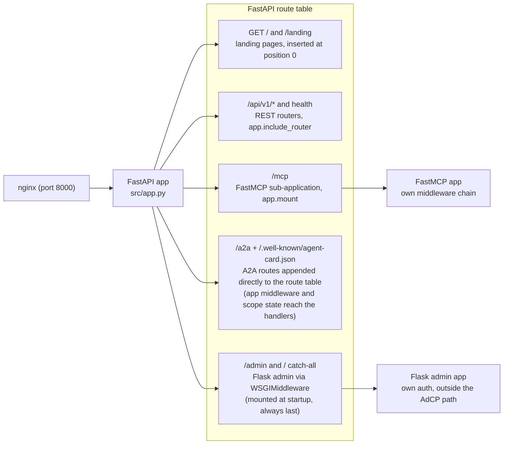
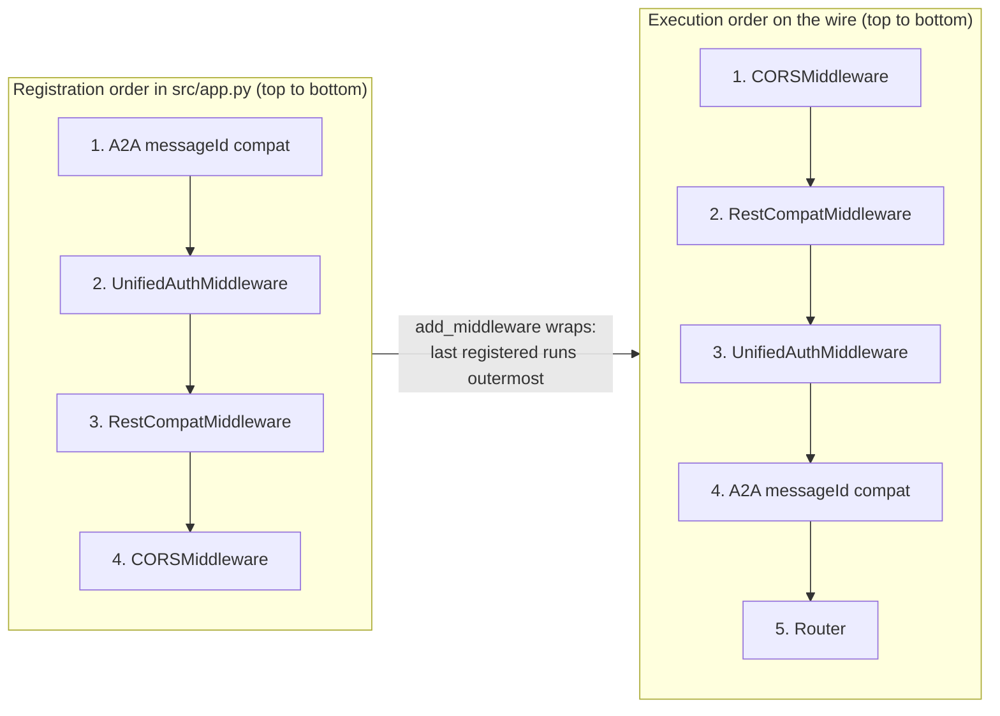
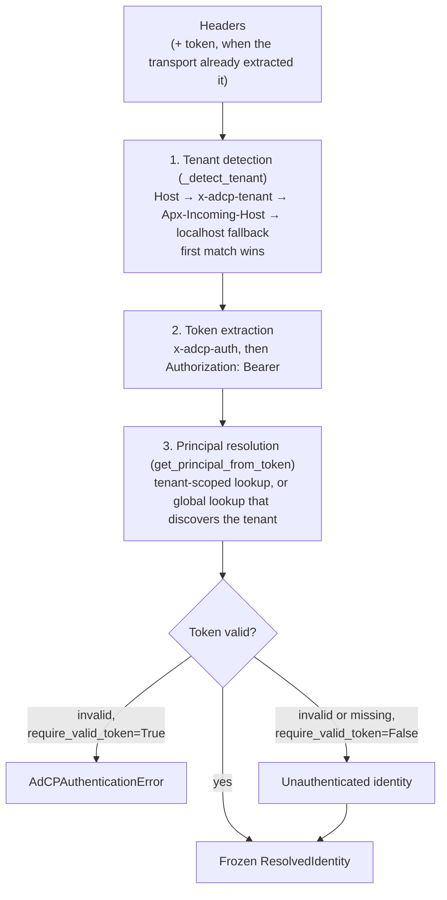
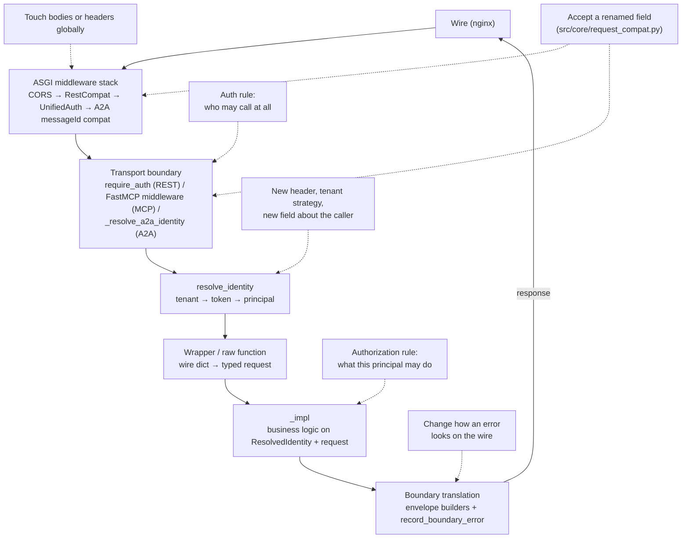

# Request lifecycle

How a request travels from the wire to business logic — and what has already
happened to it by the time your `_impl` function runs.

Read this before adding anything to the request path: a header to read, a field
to normalize, an auth rule, a tenant-scoped check. Each of those has exactly one
layer that owns it (see [Where does my change go?](#where-does-my-change-go) at
the end). The principles this layering serves — why logic lives only in
`_impl`, and why construction and serialization happen only at the boundary —
are in [architecture-principles.md](architecture-principles.md).

## One process, four entry points

A single FastAPI application, built in `src/app.py`, serves everything.
nginx sits in front (port 8000 locally) and proxies to it; there is no
per-protocol process. The app exposes four kinds of entry point:

| Path | Protocol | How it is registered |
|------|----------|----------------------|
| `/api/v1/*` | REST | FastAPI routes from `src/routes/api_v1.py` (`app.include_router`) |
| `/mcp` | MCP | FastMCP sub-application (`mcp.http_app()`), mounted with `app.mount("/mcp", mcp_app)` |
| `/a2a` + `/.well-known/agent-card.json` | A2A (JSON-RPC) | a2a-sdk route factories, appended **directly** to the FastAPI app's route table — not mounted as a sub-app, so the app's middleware and `scope["state"]` are visible to A2A handlers |
| `/admin` and `/` (catch-all) | Admin UI | The Flask admin app (`src.admin.app.create_app`), wrapped in `WSGIMiddleware` and mounted into FastAPI |

How each entry point reaches the shared application — and which of them are
sub-applications rather than plain routes on the app itself:



Two details deserve attention:

- **The admin UI is a Flask app living inside the FastAPI app.** The lifespan
  hook mounts it at startup (via `_install_admin_mounts()`) rather than at
  import time, which guarantees that the root catch-all mount is the *last*
  route — every FastAPI route, including routes added later, gets a chance to
  match before the Flask catch-all receives the request. Admin authentication
  (Google OAuth sessions) is Flask's own and is not part of the AdCP request
  path this document traces.
- **Landing pages** for `GET /` and `GET /landing` are inserted at position 0
  of the route table, so they take precedence over the root Flask mount. They
  resolve the tenant from the `Host` header and render a tenant landing page.

The app includes the health routes (`src/routes/health.py`) alongside the REST
router.

## The ASGI middleware stack and its execution order

`src/app.py` registers HTTP middleware on the root app.

> **Warning:** Starlette's `add_middleware` makes the last-registered
> middleware the outermost one, so the registration order in the file is the
> *reverse* of the execution order. A middleware that you register after
> another in the source runs *before* that one on the wire.

The two orders side by side — read the left column down the source file and the
right column down the wire:



Every HTTP request traverses the middleware in this order, outermost first:

1. **`CORSMiddleware`** — adds CORS headers to all responses
   (origins from `ALLOWED_ORIGINS`).
2. **`RestCompatMiddleware`** (`src/routes/rest_compat_middleware.py`) —
   REST-only backward-compatibility body normalization; a no-op for anything
   that is not a JSON `POST` to `/api/v1/*`. For details, see
   [Backward compatibility at the boundary](#backward-compatibility-at-the-boundary).
3. **`UnifiedAuthMiddleware`** (`src/core/auth_middleware.py`) — extracts the
   auth token and stores it, together with the request headers, in
   `scope["state"]["auth_context"]` as an immutable `AuthContext`
   (`src/core/auth_context.py`). It is a pure ASGI class (not
   `BaseHTTPMiddleware`), which keeps it free of ContextVar-propagation
   issues. It does **no** database work and resolves **no** identity — it
   only parses headers, so the per-request cost is a string scan, not a
   database round trip.
4. **A2A messageId compatibility middleware** (`a2a_messageid_compatibility_middleware`
   in `src/app.py`) — rewrites numeric `messageId` / JSON-RPC `id` values to
   strings on `POST /a2a` bodies; a no-op for every other path.
5. **The router** — REST routes, the `/mcp` mount, the A2A routes, health,
   landing, and finally the Flask admin mounts.

Token extraction in `UnifiedAuthMiddleware` checks `x-adcp-auth` first (the
AdCP convention) and falls back to `Authorization: Bearer` (case-insensitive
per RFC 7235). The resulting `AuthContext` is available as
`request.state.auth_context` in FastAPI routes and is what the A2A context
builder reads.

## Identity: `resolve_identity`

All three transports converge on one function before business logic runs:

```
resolve_identity(headers, auth_token=None, protocol="mcp"|"a2a"|"rest",
                 require_valid_token=True, testing_context=None) -> ResolvedIdentity
```

(`src/core/resolved_identity.py`.) It is the single entry point for identity
resolution, called once per request at each transport boundary. It does three
things, in order:

**1. Tenant detection** (`_detect_tenant`) — four strategies run in order, and
the first match wins:

1. `Host` header → virtual-host lookup, then subdomain extraction
   (`<subdomain>.<domain>` → tenant by subdomain; `localhost`, `www`, `admin`
   and the service's own name are excluded).
2. `x-adcp-tenant` header (set by nginx for path-based routing) → subdomain
   lookup, then direct tenant-id lookup.
3. `Apx-Incoming-Host` header (Approximated.app virtual hosts) → virtual-host
   lookup.
4. Localhost fallback → the `default` tenant.

**2. Token extraction** — the same priority as the middleware (`x-adcp-auth`,
then `Authorization: Bearer`), used only when the transport did not already
supply the token.

**3. Principal resolution** — `get_principal_from_token`
(`src/core/auth_utils.py`) looks the token up in the database. With a detected
tenant the lookup is scoped to that tenant; without one it searches globally
and *discovers* the tenant from the token. An invalid token raises
`AdCPAuthenticationError` when `require_valid_token=True`; with
`require_valid_token=False` an invalid or missing token degrades to an
unauthenticated identity instead — this is what discovery endpoints such as
`get_products` and `list_creative_formats`, and best-effort observability, use.

The same three steps as a flow, including where token validity forks the
outcome:



The result is a frozen `ResolvedIdentity`: `principal_id`, `tenant_id`,
`tenant` (a `TenantContext`), `auth_token`, `protocol`, `testing_context`
(AdCP testing hooks, parsed from headers), and `account_id` (populated by
`enrich_identity_with_account` when the request body carries an
`AccountReference`). Business logic receives this object and nothing
transport-specific — that separation is the point of the design.

`resolve_identity_from_context` (`src/core/transport_helpers.py`) is not a
second resolver; it is the bridge that adapts transport-specific context types
to the same call. Given a FastMCP `Context`, it extracts the HTTP headers and
testing context and delegates to `resolve_identity`. Given a `ToolContext`
(the context object the A2A path passes, which already holds resolved identity
fields), it builds the `ResolvedIdentity` directly, with a lazy tenant that
defers the database load until a field beyond `tenant_id` is accessed.

## The path per transport

### REST

```
wire → CORS → RestCompat → UnifiedAuth → route → Depends(require_auth) → handler → _impl
```

1. `RestCompatMiddleware` stores the body bytes **as sent** on
   `request.state.raw_wire_payload` (the idempotency payload-hash input), then
   normalizes deprecated field names so that Pydantic parses current-version
   names.
2. `UnifiedAuthMiddleware` sets `request.state.auth_context`.
3. The route's dependency resolves identity (`src/core/auth_context.py`):
   `RequireAuth` / `require_auth` raises `AdCPAuthRequiredError` (a 401
   envelope) when the token is missing or invalid; `ResolveAuth` /
   `resolve_auth` is the auth-optional variant for discovery endpoints and
   yields `None` instead of raising. Both call `resolve_identity(...,
   protocol="rest")` and set the tenant ContextVar (`set_current_tenant`) at
   the boundary.
4. The route handler in `src/routes/api_v1.py` coerces wire dicts into SDK
   types and calls the shared `_impl`/`_raw` function with the identity.
5. The app-level exception handlers in `src/app.py` translate errors:
   `AdCPError` (and normalized `ValueError` / `PermissionError` /
   `RequestValidationError` / `ToolError`) become the two-layer AdCP error
   envelope with the exception's HTTP status. Every handler calls
   `record_boundary_error`, so logging, the activity feed, and the audit log
   behave identically across transports.

### MCP

```
wire → (root-app middleware) → /mcp mount → FastMCP → MCPAuthMiddleware
     → RequestCompatMiddleware → tool wrapper → _impl
```

The root-app middleware runs first (the mount is inside the stack), but the
MCP path does its own work with **FastMCP middleware**, registered in
`src/core/main.py`. The ordering semantics differ from Starlette:
`mcp.add_middleware` runs middleware **in registration order** — the first
added runs first.

1. **`MCPAuthMiddleware`** (`src/core/mcp_auth_middleware.py`) runs on every
   tool call. It resolves identity once (via `resolve_identity_from_context`)
   and stores it on FastMCP context state, along with the raw wire arguments
   (captured *before* any normalization — the idempotency payload-hash input)
   and the `x-context-id` header. Tools listed in `AUTH_OPTIONAL_TOOLS`
   (the discovery tools) resolve with `require_valid_token=False`; every other
   tool requires a valid token.
2. **`RequestCompatMiddleware`** (`src/core/mcp_compat_middleware.py`)
   normalizes the tool arguments — see
   [Backward compatibility at the boundary](#backward-compatibility-at-the-boundary).
3. The tool wrapper (registered via `mcp.tool(...)` in `src/core/main.py`,
   wrapped in `with_error_logging`) reads the pre-resolved identity —
   `identity = await ctx.get_state("identity")` — and calls `_impl`. Tool
   wrappers do not call `resolve_identity` themselves.
4. Errors: `with_error_logging` (`src/core/tool_error_logging.py`) translates
   typed `AdCPError`s into an `AdCPToolError` carrying the same two-layer
   envelope, marked `isError: true` on the MCP wire.

MCP needs its own auth layer rather than sharing `UnifiedAuthMiddleware`
because the unit of work is different. The ASGI middleware sees one HTTP
request, but MCP multiplexes tool calls over a session, and auth-optionality
is a *per-tool* property (`AUTH_OPTIONAL_TOOLS`) that only the FastMCP layer
can see. The ASGI layer still runs and extracts the token; the FastMCP layer
is where identity is resolved and attached to the tool-call context.

### A2A

```
wire → CORS → RestCompat(no-op) → UnifiedAuth → messageId compat → /a2a route
     → AdCPCallContextBuilder → AdCPRequestHandler → _resolve_a2a_identity
     → skill handler → raw function / _impl
```

1. The A2A JSON-RPC routes are plain routes on the FastAPI app, built by the
   a2a-sdk route factories with `AdCPCallContextBuilder`
   (`src/a2a_server/context_builder.py`) as the context builder. The builder
   copies `request.state.auth_context` (set by `UnifiedAuthMiddleware`) into
   the SDK's `ServerCallContext.state` — this is the bridge between the ASGI
   layer and the SDK's handler layer, and it is why the routes must live on
   the app itself rather than in a sub-app: `scope["state"]` has to propagate.
2. `AdCPRequestHandler` (`src/a2a_server/adcp_a2a_server.py`) handles
   `message/send`. It resolves identity **once** per request via
   `_resolve_a2a_identity`, which reads the token and headers from the
   `AuthContext`, extracts the testing context, calls
   `resolve_identity(..., protocol="a2a")`, sets the tenant ContextVar, and
   translates auth failures into A2A errors. Unauthenticated requests are
   allowed through (with `require_valid_token=False`) only when every
   requested skill is in the `DISCOVERY_SKILLS` set. No downstream handler calls `resolve_identity` again.
3. Explicit skill invocations dispatch through `_handle_explicit_skill` to a
   per-skill handler, which calls the shared raw function / `_impl` with the
   pre-resolved identity (some build a `ToolContext` from it via
   `_make_tool_context` — no database calls, identity is already resolved).
4. Errors: `AdCPError` from business logic becomes a **failed Task** whose
   artifact carries the two-layer envelope; JSON-RPC errors (`A2AError`) are
   reserved for transport-protocol failures such as unknown methods.

The agent card at `/.well-known/agent-card.json` is served by a dynamic route
that rewrites the advertised A2A URL per tenant from the `Host` /
`Apx-Incoming-Host` headers (trusting `X-Forwarded-Proto` for the scheme).

## Backward compatibility at the boundary

Two middleware classes translate requests that use deprecated field names into
the current request structure. Both run **at the boundary** for the same
reason: the Pydantic request models parse strictly (and in production ignore
unknown fields), so by the time a model exists, an unrecognized or renamed
field is already gone — the only place a translation can see the buyer's
original field names is before parsing. Putting the translation anywhere else
would either lose the data or force every `_impl` function to accept every
historical field name. Both delegate the actual field mapping to the shared
normalizer in `src/core/request_compat.py`, so REST and MCP accept the same
deprecated names by construction.

**`RestCompatMiddleware`** (`src/routes/rest_compat_middleware.py`): for JSON
`POST`s to the `/api/v1/` endpoints it knows (`/products`, `/media-buys`,
`/creatives/sync`), it stores the raw body bytes for idempotency hashing,
runs `normalize_request_params` for the corresponding tool, and replaces the
request body with the normalized JSON so that FastAPI's model parsing sees
current-version field names. Malformed JSON passes through untouched for
FastAPI to reject with the proper envelope.

**`RequestCompatMiddleware`** (`src/core/mcp_compat_middleware.py`), the MCP
counterpart, is a three-stage pipeline on every tool call:

1. Translate deprecated field names (`normalize_request_params`).
2. In **production only**, strip fields that are not in the tool's JSON
   Schema — callers on later schema versions are not rejected. In dev/CI,
   unknown fields flow through and cause a visible failure, which is how a
   missing field in the server's own schema gets noticed.
3. If FastMCP's TypeAdapter still rejects the arguments: in production, retry
   once after recursively stripping *nested* fields that are not in the
   schema; if it still fails (or in dev), translate the validation failure
   into the AdCP validation envelope and record it via
   `record_boundary_error`.

Both paths capture the raw, untranslated payload *before* these rewrites
(`request.state.raw_wire_payload` on REST, the `raw_wire_payload` context
state on MCP), because AdCP defines idempotency payload-equivalence over the
request **as the buyer sent it** — a change to the seller's compatibility
mapping must not turn a legitimate retry into a conflict.

## Where the path ends: the `_impl` handoff

Everything in the preceding sections exists to produce two things: a validated
request object with current-version field names, and a `ResolvedIdentity`. At
that point the transport's job is done and Critical Pattern #5
([CLAUDE.md](../../CLAUDE.md), and
[patterns-reference.md](patterns-reference.md)) takes over:

- The wrapper calls the shared `_impl` function with the request and the
  `ResolvedIdentity` — never a `Context`, `ToolContext`, or raw headers.
- `_impl` is transport-agnostic: zero imports from fastmcp/a2a/starlette/
  fastapi, raises typed `AdCPError` subclasses, returns model objects.
- The boundary translates the result and any `AdCPError` back into the
  transport's wire format (REST envelope + HTTP status, MCP `isError` tool
  error, A2A failed Task) — symmetrically, via the shared envelope builders
  and `record_boundary_error`.

Structural guards enforce this boundary
([structural-guards.md](structural-guards.md)):
`test_transport_agnostic_impl.py`, `test_impl_resolved_identity.py`,
`test_no_toolerror_in_impl.py`, `test_architecture_boundary_completeness.py`.

## Where does my change go?

The end-to-end path with the common insertion points (dashed) attached to the
layer that owns each one; the table below maps specific changes onto the same
layers:



| Change you want to make | It belongs in | Not in |
|---|---|---|
| Read a new HTTP header for all transports | `resolve_identity` / `_detect_tenant` (identity-related), or the relevant boundary helper — headers reach every boundary | `_impl` (never sees headers) |
| Accept a renamed/deprecated request field | The shared normalizer, `src/core/request_compat.py` — both compat middleware classes pick it up | Route handlers, tool wrappers, `_impl` |
| Add an auth rule (who may call at all) | REST: the `require_auth`/`resolve_auth` dependencies; MCP: `MCPAuthMiddleware` / `AUTH_OPTIONAL_TOOLS`; A2A: `_resolve_a2a_identity` | Scattered checks inside `_impl` |
| Add an authorization rule (what this principal may do) | `_impl`, using `ResolvedIdentity` (helpers in `src/core/auth.py`: `require_identity`, `require_tenant`) | Middleware (too early — no business context) |
| Add a tenant-resolution strategy | `_detect_tenant` in `src/core/resolved_identity.py` | Per-transport code |
| Add a field to what business logic knows about the caller | `ResolvedIdentity` + populate it in `resolve_identity` | Passing extra transport args into `_impl` |
| Change how an error looks on the wire | The boundary translators: `src/app.py` exception handlers (REST), `src/core/tool_error_logging.py` (MCP), the A2A dispatcher | `_impl` (raises typed `AdCPError`, nothing else) |
| Add a REST endpoint for an existing tool | `src/routes/api_v1.py`, calling the existing `_raw`/`_impl` | New business logic in the route |
| Log/audit a boundary event | `record_boundary_error` (errors) or the boundary itself | `_impl` |
| Touch request/response bodies globally | An ASGI middleware in `src/app.py` — remember that the last registered middleware is outermost | Route handlers |

One legacy note: `src/core/mcp_context_wrapper.py` (and
`src/core/mcp_server_enhanced.py`, its only consumer) are legacy and not
registered on the active MCP path — follow the `MCPAuthMiddleware` +
`ctx.get_state("identity")` flow in [MCP](#mcp) instead.
