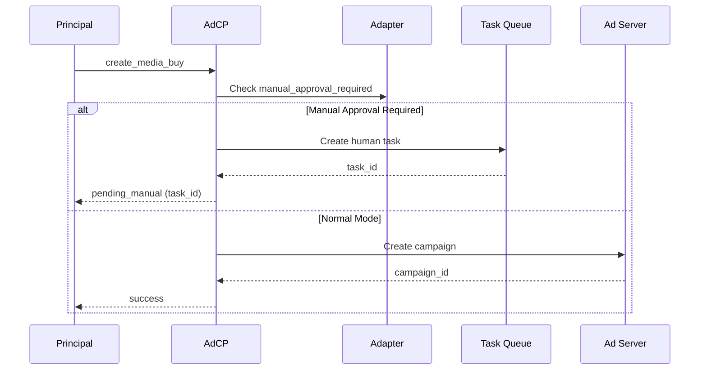

# Manual Approval Mode

## Overview

Some publishers require manual approval for all automated ad operations to maintain full control over their inventory. The AdCP Sales Agent platform supports a manual approval mode that intercepts operations and creates human tasks instead of executing them immediately.

## Configuration

Enable manual approval mode in your adapter configuration:

```json
{
  "ad_server": {
    "adapter": "google_ad_manager",
    "network_code": "123456",
    "manual_approval_required": true,
    "manual_approval_operations": [
      "create_media_buy",
      "update_media_buy", 
      "add_creative_assets"
    ]
  }
}
```

### Configuration Options

- `manual_approval_required`: Boolean flag to enable manual approval mode
- `manual_approval_operations`: Array of operations that require approval
  - `create_media_buy`: Campaign/order creation
  - `update_media_buy`: Campaign/package updates (pause, resume, budget changes)
  - `add_creative_assets`: Creative assignment to campaigns

## How It Works

### 1. Operation Interception

When a principal calls `create_media_buy` or `update_media_buy`:



### 2. Task Creation

The system creates a human task with:
- **Type**: `manual_approval`
- **Priority**: `high` for create, `medium` for updates
- **Context**: Complete request details for later execution
- **SLA**: 4 hours for create, 2 hours for update

### 3. Manual Review Process

Publishers review pending tasks:

```bash
# Get all pending manual approval tasks
GET /get_pending_tasks
{
  "task_type": "manual_approval",
  "include_overdue": true
}

# Response shows tasks requiring attention
{
  "tasks": [{
    "task_id": "task_abc123",
    "task_type": "manual_approval",
    "operation": "create_media_buy",
    "priority": "high",
    "context_data": {
      "request": { ... },
      "principal_id": "acme_corp",
      "adapter": "google_ad_manager"
    }
  }]
}
```

### 4. Task Resolution

Admin approves or rejects the task:

```bash
# Approve and execute
POST /complete_task
{
  "task_id": "task_abc123",
  "resolution": "approved",
  "resolution_detail": "Verified budget and targeting",
  "resolved_by": "ops@publisher.com"
}

# Reject
POST /complete_task
{
  "task_id": "task_abc123",
  "resolution": "rejected",
  "resolution_detail": "Budget exceeds approved limit",
  "resolved_by": "ops@publisher.com"
}
```

### 5. Deferred Execution

Upon approval, the system:
1. Reconstructs the original request from task context
2. Executes the operation on the ad server
3. Updates internal state (media_buys, etc.)
4. Logs the completion with audit trail

## Use Cases

### Publisher-Controlled Inventory

Publishers who want to:
- Review all campaign parameters before creation
- Verify creative content before serving
- Maintain manual oversight of budget changes

### Compliance Requirements

Organizations that need:
- Multi-person approval workflows
- Audit trails for all operations
- Manual verification of targeting parameters

### Limited Access Scenarios

When the AdCP service account has:
- Read-only permissions in the ad server
- Restricted access requiring manual intervention
- Temporary permission limitations

## Best Practices

### 1. SLA Management

Set appropriate due times based on operation urgency:
```python
due_in_hours = {
    "create_media_buy": 4,      # New campaigns
    "update_media_buy": 2,      # Time-sensitive updates
    "add_creative_assets": 24   # Creative review
}
```

### 2. Webhook Integration

Configure webhooks for urgent tasks:
```json
{
  "hitl_webhook_url": "https://slack.com/webhooks/urgent-tasks"
}
```

### 3. Batch Processing

Review multiple tasks together:
```bash
# Get all pending tasks for a principal
GET /get_pending_tasks?principal_id=acme_corp
```

### 4. Partial Approval

Some operations can be partially approved:
- Approve campaign creation but reduce budget
- Approve update but modify targeting
- Approve creative with conditions

## Monitoring

Track manual approval metrics:

```sql
-- Average approval time
SELECT 
  AVG(TIMESTAMPDIFF(HOUR, created_at, completed_at)) as avg_hours
FROM human_tasks
WHERE task_type = 'manual_approval'
  AND status = 'completed';

-- Rejection rate
SELECT 
  COUNT(CASE WHEN resolution = 'rejected' THEN 1 END) * 100.0 / COUNT(*) as rejection_rate
FROM human_tasks
WHERE task_type = 'manual_approval';
```

## Security Considerations

1. **Access Control**: Only admins can complete manual approval tasks
2. **Context Integrity**: Task context is immutable once created
3. **Audit Trail**: All approvals/rejections are logged with timestamp and approver
4. **Timeout Handling**: Overdue tasks can trigger escalation workflows

## Migration Path

To enable manual approval for existing integrations:

1. Update adapter configuration
2. Deploy updated AdCP Sales Agent server
3. Test with a single principal first
4. Monitor task queue and approval times
5. Gradually enable for more principals

## Limitations

- Tasks are stored in-memory (production should use persistent storage)
- No built-in approval workflows (single approver model)
- Context size limited by storage constraints
- No automatic retry on approval failures