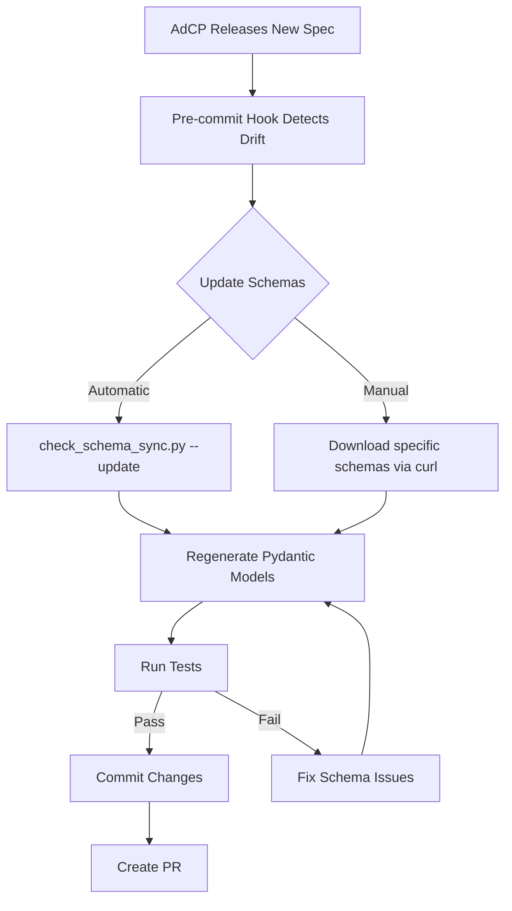

# AdCP Schema Update Process

This document describes how to keep our locally cached AdCP schemas synchronized with the official spec at https://adcontextprotocol.org/schemas/v1/.

## Overview

We maintain local cached copies of AdCP schemas in `schemas/v1/` for:
- Offline development and testing
- Schema validation in CI
- Pydantic model generation via `scripts/generate_schemas.py`

**Critical:** Outdated cached schemas can cause schema generator issues, leading to incorrect types (e.g., `list[str]` instead of `list[FormatId]`).

## Automated Protection

### Pre-commit Hook (Runs Automatically)

The pre-commit hook runs `scripts/check_schema_sync.py --ci` on **every commit**, which:
1. **Validates format_ids structure** - Ensures package-request.json uses FormatId objects, not strings
2. **Checks critical schemas** - Compares package-request.json, format-id.json, and 5 other key schemas
3. **Validates all schemas** - Checks all 30+ cached schemas match live versions
4. **Reports mismatches** - **Blocks commits** if schemas are out of sync

**This prevents the root cause of the format_ids issue** where outdated cached schemas caused the generator to produce incorrect types.

### What Gets Validated

**Every commit automatically checks:**
- ✅ Format IDs structure (FormatId objects, not strings)
- ✅ 7 critical schemas (package-request, format-id, product, creative-asset, targeting, get-products)
- ✅ 30+ implemented endpoint schemas
- ✅ Schema index version

**If validation fails, commit is blocked:**
```bash
❌ ERROR: Schema out of sync: /schemas/v1/media-buy/package-request.json
💡 To fix: uv run python scripts/check_schema_sync.py --update
```

## When to Update Schemas

Update schemas when:
- ✅ AdCP releases a new version (monitor https://github.com/adcontextprotocol/adcp/pulls)
- ✅ Pre-commit hook reports schema drift
- ✅ CI fails with schema validation errors
- ✅ Before regenerating Pydantic models

## How to Update Schemas

### Automatic Update (Recommended)

```bash
# Download latest schemas from adcontextprotocol.org
uv run python scripts/check_schema_sync.py --update

# Verify schemas are now in sync
uv run python scripts/check_schema_sync.py

# Regenerate Pydantic models
uv run python scripts/generate_schemas.py

# Commit changes
git add schemas/ src/core/schemas_generated/
git commit -m "Update AdCP schemas to latest from registry"
```

### Manual Update

If you need to update a specific schema:

```bash
# Download specific schema
curl -s https://adcontextprotocol.org/schemas/v1/media-buy/package-request.json > \
  schemas/v1/_schemas_v1_media-buy_package-request_json.json

# Download dependencies (e.g., format-id.json)
curl -s https://adcontextprotocol.org/schemas/v1/core/format-id.json > \
  schemas/v1/_schemas_v1_core_format-id_json.json

# Verify schema structure
cat schemas/v1/_schemas_v1_media-buy_package-request_json.json | \
  jq '.properties.format_ids.items'

# Should show: {"$ref": "/schemas/v1/core/format-id.json"}
# NOT: {"type": "string"}

# Regenerate Pydantic models
uv run python scripts/generate_schemas.py

# Verify generated code is correct
grep -A 5 "format_ids" src/core/schemas_generated/_schemas_v1_media_buy_package_request_json.py
# Should show: format_ids: Annotated[Optional[list[FormatId]], ...]
```

## Schema Validation Checks

### 1. Format IDs Structure Validation

**What it checks:**
- `package-request.json` uses `$ref` to `format-id.json` (not plain strings)

**Why it matters:**
- Prevents schema generator from producing incorrect types
- Ensures FormatId objects are used consistently

**How to fix:**
```bash
# If validation fails:
uv run python scripts/check_schema_sync.py --update
uv run python scripts/generate_schemas.py
```

### 2. Critical Schemas Check

**Schemas checked:**
- `/schemas/v1/core/product.json`
- `/schemas/v1/media-buy/package-request.json`
- `/schemas/v1/core/format-id.json`
- `/schemas/v1/core/creative-asset.json`
- `/schemas/v1/core/targeting.json`

**These are high-priority** because changes affect core functionality.

### 3. All Schemas Sync

**Checks all 30+ implemented endpoint schemas** against live registry.

## Troubleshooting

### Pre-commit hook fails with "Schema out of sync"

```bash
# Update schemas automatically
uv run python scripts/check_schema_sync.py --update

# Regenerate Pydantic models
uv run python scripts/generate_schemas.py

# Commit both schema cache and generated code
git add schemas/ src/core/schemas_generated/
git commit -m "Update AdCP schemas to v{version}"
```

### Schema generator produces incorrect types

**Symptom:** Generated code has `list[str]` instead of `list[FormatId]`

**Root cause:** Outdated cached schema using `{type: "string"}` instead of `$ref`

**Fix:**
```bash
# 1. Verify cached schema has $ref
cat schemas/v1/_schemas_v1_media-buy_package-request_json.json | \
  jq '.properties.format_ids.items'

# Should output: {"$ref": "/schemas/v1/core/format-id.json"}

# 2. If it shows {"type": "string"}, update schema:
uv run python scripts/check_schema_sync.py --update

# 3. Regenerate with correct input:
uv run python scripts/generate_schemas.py
```

### Format IDs validation fails

**Error:** `❌ format_ids uses strings instead of FormatId objects!`

This means the cached `package-request.json` is outdated.

**Fix:**
```bash
# Download latest schema
curl -s https://adcontextprotocol.org/schemas/v1/media-buy/package-request.json > \
  schemas/v1/_schemas_v1_media-buy_package-request_json.json

# Download format-id definition
curl -s https://adcontextprotocol.org/schemas/v1/core/format-id.json > \
  schemas/v1/_schemas_v1_core_format-id_json.json

# Regenerate models
uv run python scripts/generate_schemas.py
```

## Schema Update Workflow



## Best Practices

1. **Always update before regenerating** - Run `check_schema_sync.py --update` before `generate_schemas.py`
2. **Commit schema and generated code together** - They must stay in sync
3. **Run full test suite** - Schema changes can affect validation
4. **Document breaking changes** - If schema changes break compatibility, document in PR
5. **Monitor AdCP PRs** - Watch https://github.com/adcontextprotocol/adcp for new releases

## References

- **Schema Registry:** https://adcontextprotocol.org/schemas/v1/
- **AdCP GitHub:** https://github.com/adcontextprotocol/adcp
- **Schema Checker:** `scripts/check_schema_sync.py`
- **Schema Generator:** `scripts/generate_schemas.py`
- **Cached Schemas:** `schemas/v1/`
- **Generated Models:** `src/core/schemas_generated/`

## Recent Changes

### AdCP PR #123 (format_ids → FormatId objects)

**Changed:** `format_ids` from array of strings to array of FormatId objects

**Before:**
```json
"format_ids": ["display_300x250"]
```

**After:**
```json
"format_ids": [{
  "agent_url": "https://creatives.adcontextprotocol.org",
  "id": "display_300x250"
}]
```

**Impact:** All clients must send FormatId objects. Server maintains backward compatibility with string IDs.

**Learn more:** https://github.com/adcontextprotocol/adcp/pull/123
